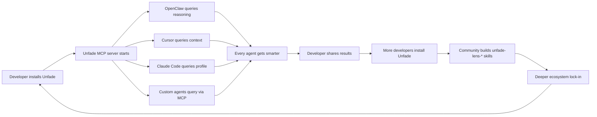
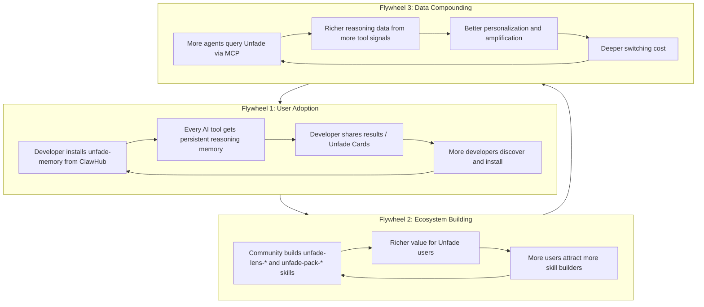
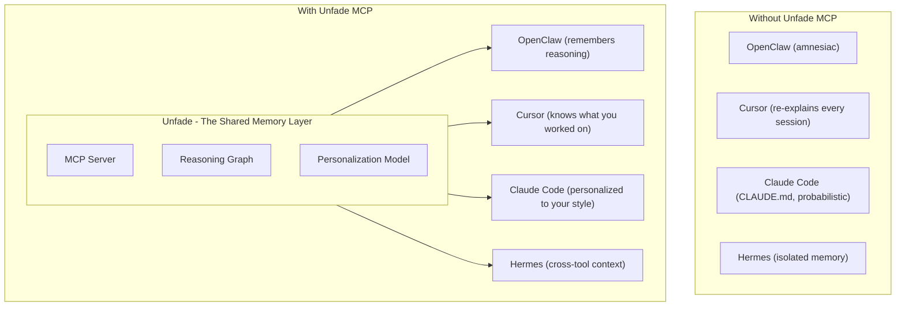
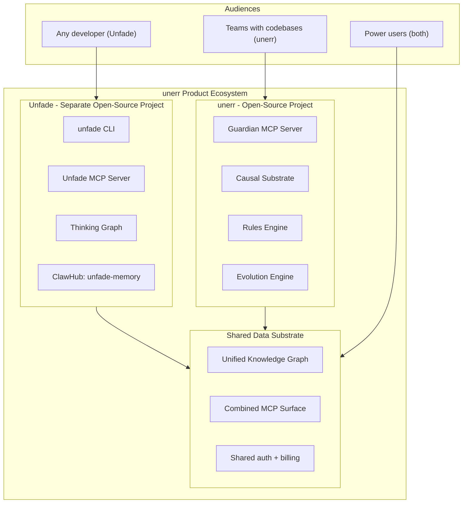
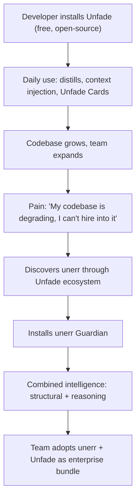
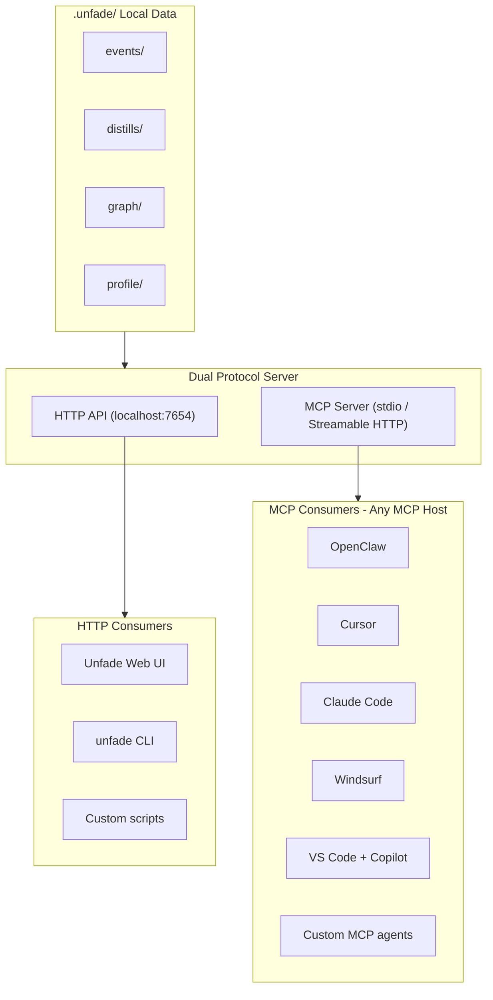

# Unfade: The Engineering Reasoning Engine — Product Strategy

> **What this document is:** The complete research-backed strategy for **Unfade** — a new, category-defining open-source product that passively captures engineering reasoning, builds a personalized reasoning substrate that makes every AI tool smarter, proactively amplifies thinking by surfacing connections across projects and time, and distills it all into a beautiful, shareable thinking identity that compounds over time. Developed through the Rigorous Research → Reason → Validate → Execute (RRVV) framework with signal synthesis from seven independent ideation pipelines.
>
> **What this document is NOT:** An implementation plan or sprint-level spec. It is the strategic foundation: why this product must exist, what the research shows, where the competitive landscape is empty, what to build, and how it compounds into a defensible business.
>
> **Relationship to unerr:** Unfade is a standalone product that occupies a complementary but independent category. unerr builds structural intelligence about *codebases*. Unfade builds reasoning intelligence about *the humans who build them*. The strategic relationship is explored in §12.
>
> **Last updated:** April 2026 (implementation status addendum added 2026-04-20)

---

## Table of Contents

- [1. The Problem: The Invisible Layer of Engineering](#1-the-problem-the-invisible-layer-of-engineering)
- [2. Research: Raw Signals From High-Signal Ecosystems](#2-research-raw-signals-from-high-signal-ecosystems)
- [3. Reason: Why This Gap Exists and Why It's Widening](#3-reason-why-this-gap-exists-and-why-its-widening)
- [4. The Seven Ideas That Converged Here](#4-the-seven-ideas-that-converged-here)
- [5. The Competitive Landscape](#5-the-competitive-landscape)
- [6. Validate: The Breakout Criteria](#6-validate-the-breakout-criteria)
- [7. Execute: What Unfade Is](#7-execute-what-unfade-is)
- [8. The Three-Layer Architecture](#8-the-three-layer-architecture)
- [9. A Day With Unfade](#9-a-day-with-unfade)
- [10. Why Unfade Wins: Retention and Organic Growth](#10-why-unfade-wins-retention-and-organic-growth)
- [11. The Compounding Moats & Ecosystem Strategy](#11-the-compounding-moats--ecosystem-strategy)
- [12. Strategic Relationship to unerr](#12-strategic-relationship-to-unerr)
- [13. What to Build & Build Sequencing](#13-what-to-build--build-sequencing)
- [14. Risk Assessment & Strategic Verdict](#14-risk-assessment--strategic-verdict)

---

## 1. The Problem: The Invisible Layer of Engineering

Software engineering produces two outputs. One is visible: code, commits, pull requests, deployed features. Every tool in the developer ecosystem measures, reviews, tracks, and celebrates this output. GitHub contribution graphs. CI/CD pipelines. PR review bots. Deployment dashboards. The visible output has an entire industry built around it.

The second output is invisible: the *reasoning* behind the code. The decisions made and the alternatives rejected. The trade-offs navigated. The dead ends explored and abandoned. The debugging sessions where understanding shifted. The architectural choices that shaped everything downstream. This reasoning is the highest-value intellectual output an engineer produces — and it evaporates the moment the commit lands.

This has always been true. But in 2026, four converging shifts have turned this invisible layer from a minor inefficiency into a crisis.

### 1.1 AI Made Output Cheap — Reasoning Became the Scarce Asset

When code generation is a commodity — any developer with Cursor or Claude Code can produce thousands of lines per day — the output is no longer the differentiating signal. The differentiator is *why* that code exists, *what alternatives were considered*, and *whether the decisions behind it were sound*. AI inflated the supply of code while the demand for reasoning remained fixed. The result: output-based signals (GitHub contributions, lines of code, commit frequency) are becoming meaningless as indicators of engineering capability.

SlopCodeBench (March 2026) proved this empirically: AI agents degrade code quality in 80–89.8% of iterative trajectories. The degradation is not in the syntax — it's in the reasoning. The agents make locally optimal decisions without understanding the global architectural context. The *code* works. The *thinking* behind it is absent.

The distinction is not "human reasoning good, AI reasoning bad." Developers in 2026 reason *through* AI — using LLMs to evaluate standards, explore architectural options, and generate implementation candidates. Some reason primarily at document-creation time, building detailed PRDs and architectural specs before any code is generated. Others reason at selection time, evaluating AI-generated alternatives against project-specific constraints. The common thread: **human judgment is the irreducible layer.** Which output to accept. Which standards apply here. Which trade-off suits this specific context. AI produces reasoning candidates; the developer produces reasoning *decisions*. That decision layer — whether it happens in an AI conversation, a design document, or a code review — is what Unfade captures.

### 1.2 Context Fragmentation Is the #1 Practical Pain Point

Developers lose 10–15 minutes per session re-explaining context to AI tools. Every ChatGPT conversation starts from zero. Every Claude Code session re-derives the codebase understanding that existed yesterday. The reasoning from last week's debugging session — which Stack Overflow thread unlocked the insight, which three approaches were tried and failed, which specific error message led to the fix — exists nowhere in a queryable form. It was in the developer's head, in browser tabs that were closed, in terminal history that scrolled away.

The research signals are unambiguous: the single most repeated practical complaint about AI tools in 2026 is not capability — it is amnesia. AI tools are powerful but perpetually amnesiac.

Recent attempts at solving this are structurally inadequate. Claude's memory stores preferences. Codex maintains persistent sessions. CLAUDE.md files accumulate project-level notes. But all three share the same flaw: they are single-tool, preference-level, and non-learning. Claude's memory doesn't help Cursor. Codex's memory doesn't help Claude. None of them build a model of how you *reason* — they remember what you said, not how you think. And none of them understand the codebase itself: its architecture, its boundaries, why it is the way it is. That structural intelligence requires a separate layer entirely (this is what unerr provides — see §12 for how the two systems compose). The context a developer needs is two-dimensional: *what the code means* and *how I think about it*. No existing tool provides either dimension persistently, let alone both.

### 1.3 Developer Identity Is in Crisis

The developer identity crisis is not hypothetical. It is the most emotionally charged signal in every developer community in 2026.

- *"Are we developers anymore? Or are we product managers for code we didn't write?"*
- *"I've spent my whole career getting good at writing code. Now AI does it faster than me. What was this all for?"*
- *"I feel tired and useless despite not being overworked."*
- *"My commit history shows fragments of work, but the highest-value activities leave no trace — debugging sessions, design discussions, insights."*
- *"83% of GitHub profiles show zero commits despite active development."*

The identity crisis is not about job security. It is about *signal collapse*. The traditional markers of engineering capability — code, contributions, commit history — are now gameable, inflatable, or invisible. But the crisis masks a deeper truth: **developers who think contextually, who make differentiated decisions, who bring judgment that LLMs structurally cannot replicate — those developers are more valuable than ever.** They just have no way to prove it. LLMs produce generic, locally-optimal reasoning. Humans produce contextual, historically-informed, taste-driven reasoning shaped by months of domain immersion. Every developer sits somewhere on a spectrum from rapid AI-assisted generation to deep architectural reasoning — and most move along that spectrum within a single day. The developers who reason deeply are more valuable than ever. But they have no way to prove it. And the developers who lean heavily on AI generation have no feedback loop that develops deeper reasoning habits. Both lose from the same signal collapse.

What these developers crave is not consolation. They crave a system that captures, compounds, and proves the thinking that makes them irreplaceable.

**Vibe coding** — Andrej Karpathy's term for workflows where the developer "fully gives in to the vibes, forget that the code even exists" — describes one end of the generation-reasoning spectrum. At its best, vibe coding is extraordinary for prototyping, exploration, and rapid validation. At its worst, it produces code without architectural reasoning — and the signal problem cuts both ways. A developer who exercises deep judgment produces *less visible output* than one who prompted the same feature in a fraction of the time. And a developer who leans heavily on AI generation has no system that helps them develop, capture, or prove the reasoning skills that distinguish sustained engineering from rapid prototyping.

This creates a crisis not just for individual developers, but for everyone who evaluates them. Startup founders, engineering managers, and CTOs need ways to distinguish depth of reasoning from volume of output — and developers at every point on the spectrum need a way to make their thinking visible, compounding, and portable. Unfade serves both: for deep thinkers, it captures and proves reasoning that would otherwise be invisible. For AI-forward developers, it creates the reflection loop that naturally develops more intentional engineering habits.

### 1.4 Every AI Tool Forgets Who You Are

There is a fourth shift, less discussed but equally consequential: **AI tools are powerful but perpetually impersonal.** Every developer who uses Claude Code, Cursor, or ChatGPT daily has internalized a quiet frustration — the tool can write a service mesh configuration in seconds, but it cannot remember that you prefer explicit error handling over try-catch wrappers. It doesn't know you evaluated Redis Cluster three months ago and rejected it for your deployment topology. It doesn't learn that you reason about trade-offs by listing alternatives explicitly before choosing.

ChatGPT added "Memory." Claude writes to CLAUDE.md files. Cursor caches project context. These are patchwork fixes — preference-level memory ("user likes Python") inside a single tool, not reasoning-level understanding ("user systematically evaluates 3+ alternatives, favors simplicity, and has deep context on distributed caching from a project last quarter") across the developer's entire workflow.

The craving is not for memory. It is for *personalization at the reasoning layer* — an AI that doesn't just recall facts about you but understands *how you think*, adapts to your decision-making style, and improves the quality of its assistance based on months of accumulated reasoning context. Today this does not exist anywhere. Every AI session starts not just without memory, but without *understanding*.

This creates a compounding irony: the more a developer uses AI tools, the more reasoning context they generate — and the more of it is lost. A developer who has been using Cursor for 12 months has produced thousands of conversations containing rich decision-making context. None of it persists. None of it personalizes the next session. The most prolific AI users suffer the worst context amnesia.

---

## 2. Research: Raw Signals From High-Signal Ecosystems

This section presents unfiltered behavioral evidence from Reddit, Hacker News, DEV Community, GitHub, Indie Hackers, X/Twitter, and creator platforms. The methodology: observe what users *do* (behaviors, hacks, workarounds), not what they *say* they want.

### 2.1 Behavioral Patterns (What People Do)

| Behavior | Where Observed | Frequency | What It Reveals |
|---|---|---|---|
| **Re-Googling the same concepts** | Universal | Daily, multiple times | No tool captures *what was learned* from a resource, only that it was visited |
| **Tab hoarding (40–80 tabs)** | Reddit r/ADHD, r/programming, HN | Very high — meme-level cultural recognition | Browser tabs are a proxy for working memory; people are desperate to preserve context |
| **Screenshot hoarding** | Creator communities, design forums | High | Screenshots are "memory anchors" — urgent captures of context that will evaporate |
| **"Note to self" scatter** | Slack DMs to self, email drafts, random .txt files, Apple Notes | Universal | Knowledge is spread across a dozen silos with zero connections |
| **Manual weekly reviews** | Indie Hackers, "build in public" creators, engineering managers | Weekly — often abandoned after 3–4 weeks | People want to account for their intellectual output but the effort is unsustainable |
| **"Today I Learned" posts** | DEV Community, Reddit r/learnprogramming, X | Daily threads, high engagement | People want to document and share micro-learnings — the format exists, the automation doesn't |
| **Filming end-of-session Loom videos** | Indie hackers, solo founders | Documented pattern — used for next-day continuity | Desperate measure to preserve session context across days |
| **Nightly automation scripts** | HN "Show HN," GitHub personal projects | Growing | Developers building custom tools to synthesize "where did my week go?" — a clear gap signal |
| **Pasting context preambles into AI conversations** | Universal across ChatGPT/Claude users | Every session | AI amnesia forces manual context transfer — people copy-paste paragraphs of context into every new session |
| **Curating "awesome-X" repos** | GitHub (collectively millions of stars) | Persistent, cultural | People invest enormous effort in curating collections that signal *taste and judgment* — identity work disguised as resource sharing |
| **Pasting system prompt "personalities" into AI** | ChatGPT custom instructions, Claude Projects, .cursorrules files | Universal among power users | People manually encode their preferences and reasoning style into every new AI context — rebuilding a crude personality layer from scratch each time |
| **Building personal CLI wrappers around LLMs** | GitHub, r/LocalLLaMA, HN "Show HN" | Accelerating | Developers building custom shells that prepend personal context before every LLM call — hand-rolling the personalization layer that no tool provides |
| **Wishing AI "just knew" their codebase history** | r/ClaudeCode, Cursor Forum, ChatGPT feedback threads | Daily threads, high emotional intensity | The most repeated wish: "I want my AI to know what I was working on yesterday without me telling it" — cross-tool persistent memory does not exist |
| **Re-debugging the same class of issue** | Universal | Weekly — often unrecognized until it happens | Developers solve the same category of bug repeatedly because the reasoning from the first fix exists nowhere queryable — the solution evaporated with the terminal session |

### 2.2 Emotional Signals (What People Say)

**The Existential Cluster:**

- *"The meditative middle of coding has collapsed."* — Reddit, multiple threads
- *"I have an identity crisis every day now."* — X/Twitter, 15-year veteran developer
- *"If AI can build what I build, but faster, what was the point of all those years?"* — HN, front-page discussion
- *"The most valuable skill in 2026 isn't writing code. It is deleting it."* — DEV Community, widely cited

**The Practical Cluster:**

- *"I spend 10-15 minutes every session re-explaining context."* — Reddit r/ClaudeCode, recurring
- *"I mass-unsubscribed from 40 changelog newsletters."* — HN
- *"I've tried Obsidian, Notion, Logseq, and three custom scripts. Nothing captures what I actually *think* during work."* — Reddit r/productivity
- *"My AI doesn't know me. Every conversation starts from scratch."* — Universal sentiment

**The Identity/Recognition Cluster:**

- *"Developer trust in AI accuracy dropped from 40% to 29%."* — JetBrains Developer Survey 2026
- *"'Slop' was Merriam-Webster's 2025 Word of the Year."* — Cultural indicator
- *"I want proof — for myself and for hiring managers — that I'm the one who thinks, not just the one who prompts."* — Indie Hackers
- *"There should be a way to prove thinking, not just typing."* — Reddit r/ExperiencedDevs

### 2.3 Movement Signals (Cultural Shifts in Progress)

Three independent cultural movements appeared in late 2025 through early 2026, all pointing to the same underlying craving:

**The Artisanal Code Movement.** The Human-Crafted Software Manifesto, the Artisanal Coding manifesto, and "Organic Free-Range Programming" all emerged independently. These are not anti-AI — they are anti-*carelessness*. They demand intentionality, ownership, and proof of deliberate thinking. But manifestos don't ship products. The movement lacks a *tool* that embodies its values.

**The "Build in Public" Fatigue.** The performative sharing model is breaking down. Research shows 2.3x higher failure rates for projects with heavy "build in public" activity. Developers spending 3.2x more time on content than building. The craving for visible progress hasn't disappeared — the *mechanism* (tweeting about what you're building) has become exhausting and counterproductive.

**The "Proof of Thought" Demand.** Multiple tools appeared in the last 6 months attempting to capture reasoning: `git-why` (reasoning traces in `.why/` directories), `g4a` (reasoning chains in git), `bp-commit-reflect` (post-commit reflection prompts), `Chainloop trace` (cryptographic attestation of AI sessions), `AgentReplay` (local AI observability). None broke through. They are all infrastructure with no experiential or social layer. The problem is seen. The product is missing.

---

## 3. Reason: Why This Gap Exists and Why It's Widening

### 3.1 The Structural Gap

There is a massive, widening gap in the developer tooling ecosystem. It sits at the intersection of four failed categories:

**Category 1: "Store What You Know" tools** — Notion, Obsidian, Roam, Mem.ai. These require manual input. They capture what you deliberately write down — which is 5% of what you think. The other 95% evaporates. The maintenance burden causes abandonment within weeks.

**Category 2: "Record Everything" tools** — Rewind.ai, Microsoft Recall. These capture too much, with catastrophic privacy implications. Full-screen recording produces terabytes of noise with no conceptual understanding. The signal-to-noise ratio makes them useless for reasoning retrieval. The privacy backlash (Recall was pulled after public outcry) proves the approach is culturally unacceptable.

**Category 3: "Activity Metrics" tools** — GitHub contribution graphs, GitPulse, WakaTime, CodeAddict, TopSignal. These measure *output* — commits, streaks, lines changed, time spent. In the age of AI, output metrics are meaningless. A developer who spent 4 hours deeply reasoning about a caching strategy and made 2 commits shows less "activity" than one who spent 4 hours prompting Claude Code and made 40 commits of mediocre quality.

**Category 4: "Chat Memory" tools** — ChatGPT Memory, Claude CLAUDE.md, Cursor .cursorrules. These are the industry's first attempts at AI personalization, and they reveal the depth of the craving by how inadequate they are. ChatGPT Memory stores facts ("user prefers TypeScript") — not reasoning patterns ("user systematically evaluates 3+ alternatives, prefers explicit error handling, and has strong opinions about caching that were shaped by a Redis Cluster failure last quarter"). CLAUDE.md is probabilistic text the model writes to itself — different each run, stale when code changes, unreadable by the developer. .cursorrules is a static prompt prepended to every session — manually maintained, never learning, and scoped to a single project. All three share the same structural flaw: they are **single-tool, preference-level, and non-learning**. None of them build a model of how the developer *reasons*. None persist across tools. None improve with use.

**What all four categories miss:** A tool that captures *reasoning* — not notes, not screen recordings, not commit counts, not chat preferences — and makes it queryable, shareable, personalizing, and compounding. The reasoning layer of development work has no tooling at all. More critically: no tool *learns how a developer thinks* and uses that understanding to improve every subsequent AI interaction across their entire toolchain.

### 3.2 Why the Gap Is Widening

Four forces are making this gap larger, not smaller:

1. **AI makes more output per unit of reasoning.** As agents become more capable, the ratio of "code produced" to "thinking done" increases. More output to account for, less visible reasoning behind it.

2. **Context windows are longer but memory doesn't persist.** Claude Code now handles 200K tokens per session. But sessions still reset. The fundamental problem — "the AI doesn't know what I was working on yesterday" — remains completely unaddressed by any capability improvement.

3. **Hiring signals are collapsing.** 40% of employers are abandoning resume-first hiring. GitHub profiles are gameable. Take-home tests can be AI-completed. The demand for a new, harder-to-fake signal of engineering capability is accelerating.

4. **The solo builder era amplifies the need for personal signal.** AI compresses the gap between individuals and funded teams. But it amplifies the need for *personal identity and signal*. When a solo builder can ship what a 5-person team shipped in 2023, the question becomes: "How do I prove that *I'm* the one who made the right decisions?"

---

## 4. The Seven Ideas That Converged Here

Unfade is not a single brainstorm. It is the synthesis of seven independent ideation pipelines, each developed through the RRVV framework, each identifying a different facet of the same underlying opportunity. The synthesis took the strongest validated element from each and discarded the weak ones.

| # | Idea | Core Premise | Strongest Element (Kept) | Weakness (Discarded) |
|---|---|---|---|---|
| 1 | **Engram** | Passive knowledge capture → queryable personal knowledge graph → shareable "knowledge identity card" | The "knowledge identity" concept — externalized intellectual profile as a new social artifact | Scope too broad (capture from 10+ sources). Cold start problem — empty graph delivers zero value |
| 2 | **ThinkUnfade** | Git/AI session observation → daily reasoning distill → "Thinking Graph" as developer identity | **The backbone of the final product**: daily distill ritual, Unfade Cards, Thinking Graph, developer-scoped identity, git-as-primary-signal | None — this is the primary contributor to the final design |
| 3 | **Forge** | Chaotic brain dumps → AI synthesis → daily shareable "Forge Artifacts" | Turning messy daily input into polished artifacts with minimal effort — the "zero-to-artifact" promise | The 5–10 minute active "ritual" is too high a friction bar for habit formation. General-purpose audience dilutes focus |
| 4 | **MirrorForge** | Connect life data → daily AI-generated visual "Mirror Snapshot" → growth meter | The emotional concept of "seeing yourself evolve" — the mirror metaphor | Too inspirational, not enough utility. "See your AI portrait" is a novelty that wears off without functional depth |
| 5 | **Unfade Substrate** | Ambient capture → persistent local vector graph → context API for other tools → "telepathic AI" | **The platform layer**: persistent local context graph, Unfade Hooks API, cross-tool context injection, the "memory substrate" concept | Invisible infrastructure alone produces no shareable artifact, no identity layer, no viral mechanic |
| 6 | **Loom** | Dump raw inputs → AI collides ideas serendipitously → daily "Sparks" + shareable "Tapestries" | The "Lens" marketplace concept — shareable reasoning frameworks others can apply to their own data | "Serendipitous connections" as primary value is too speculative. Quality depends on frontier AI capabilities that are hard to control |
| 7 | **Unfade.os** | Local-first ambient daemon → 3D mind map → generative art "Unfade Cards" | Beautiful, generative visualization of intellectual activity — the aesthetics matter for shareability | Screen capture (too invasive, too Rewind-like). "Art first, utility second" inverts the priority |

### Why This Synthesis Wins

The scoring matrix across eight critical dimensions (immediate pain, daily loop, creation loop, ecosystem/moat, feasibility, zero competition, organic spread, day-1 value) revealed that no single idea scored highest across all dimensions. But two ideas were perfectly complementary:

- **ThinkUnfade** had the strongest emotional resonance (solves the identity crisis), the best sharing mechanism (Unfade Cards), and the highest feasibility (ship in weeks) — but limited ecosystem depth.
- **Unfade Substrate** had the strongest ecosystem potential (context API as platform), the deepest compounding moat (data switching cost), and the best daily utility (always-on context injection) — but no viral mechanic or shareable artifact.

Combined, they create something neither achieves alone: **a product that solves the practical pain (context amnesia) AND the existential pain (identity crisis) through a single data stream that powers both invisible utility and visible identity.**

---

## 5. The Competitive Landscape

> **Full analysis:** See **[Unfade Competitive Analysis](./unfade_competitor_analysis.md)** for the comprehensive competitive intelligence report covering 8 categories, 40+ tools, the Dumbbell Pattern, Six-Stage Depth Map, honest vulnerability assessment, and strategic playbook.

**Key findings:**

- **40+ tools** across 8 categories touch some part of the reasoning/identity/context space. None connect capture → distillation → identity → context injection → ecosystem in a unified product.
- **No competitor covers more than 2.5 of 6 stages** in the Unfade pathway (Capture → Personalization → Amplification → Identity → Ecosystem → Cross-Tool Memory).
- **The Dumbbell Pattern:** Competitors cluster at both ends (11 capture tools, 5 MCP memory servers) while the middle stages — personalization, amplification, identity, ecosystem — remain structurally empty.
- **The temporal moat:** The middle stays empty because time itself is the barrier to entry. A competitor cannot produce 6 months of *your* reasoning patterns without 6 months of observation, regardless of funding or engineering talent.
- **The core differentiator:** The reasoning personalization engine — the system that learns how you think and compounds that understanding over months — defeats every competitor category because it occupies the structural gap that defines the entire opportunity.

The closest analogy: GitHub created "developer identity through code contribution." Strava created "athletic identity through activity." **Nobody has created "engineering identity through reasoning."** That category is empty.

---

## 6. Validate: The Breakout Criteria

For a product to achieve breakout adoption — not just early interest, but daily embedded use — it must pass two critical tests inspired by tools like GitHub, Strava, and Spotify Wrapped.

### 6.1 The Creation Loop Test

**Question:** Does the product enable users to build, transform, or generate something tangible that they can showcase, iterate on, or derive identity from?

**Unfade's answer: Yes — emphatically.**

Unfade produces three tangible artifacts from a single data stream:

**The Daily Distill.** A one-page auto-generated reasoning summary: decisions made, trade-offs navigated, dead ends explored, breakthroughs achieved. Not a commit log — a *thinking log*. Reviewable in 2 minutes. Optionally publishable. This is a new content format: more structured than a tweet, more authentic than a blog post, more substantive than a commit message.

**The Unfade Card.** A beautifully designed, shareable card summarizing a day's reasoning. Think Spotify Wrapped meets an engineering decision log. "Today I evaluated 3 caching strategies, chose write-behind because of latency constraints, explored Redis Cluster but abandoned it due to deployment topology." Purpose-built for sharing on X, LinkedIn, Discord. Aspirational and authentic simultaneously.

**The Thinking Graph.** A visual, interactive profile that compounds over time:
- *Decision Density Heatmap* — like GitHub's contribution graph, but for reasoning moments, not commits
- *Thinking Patterns* — "Consistently evaluates 3+ alternatives," "Strong at edge case detection," "Favors simplicity over cleverness"
- *Domain Evolution* — how expertise in specific areas has deepened over months
- *Unfade Threads* — connected decision chains across days/weeks showing how a single choice rippled through subsequent work

The Thinking Graph is the primary identity artifact. It is embeddable, linkable, and beautiful. It goes in bios, portfolios, and job applications. It is the first developer identity artifact grounded in *reasoning*, not activity.

**Identity formation:** "Check out my Unfade" becomes meaningful in the same way "Check out my GitHub" became meaningful — but for a signal that is harder to fake and more valuable in the AI age.

### 6.2 The Ecosystem + Memory Moat Test

**Question:** Does the product accumulate persistent context that makes it more valuable over time and enables an ecosystem to emerge?

**Unfade's answer: Yes — this is the structural moat.**

**Compounding value trajectory:**

| Time | What Unfade Knows | Value Level |
|---|---|---|
| **Week 1** | Recent git commits, a few AI session logs | Marginally useful — daily distill is interesting but shallow |
| **Month 1** | Pattern of decisions across projects, recurring trade-offs, exploration habits | Genuinely useful — "What did I decide about X?" is answerable |
| **Month 6** | Deep reasoning profile, cross-project decision patterns, domain expertise topology | Hard to leave — context injection into AI tools is noticeably better than vanilla |
| **Year 1** | Comprehensive thinking identity, year-over-year growth visible, rich domain maps | Irreplaceable — switching cost is absolute. Your Thinking Graph cannot be exported or recreated |

**Ecosystem primitives:**

| Layer | What Emerges | Timeline |
|---|---|---|
| **Connectors** | Community-built integrations: VS Code, JetBrains, Chrome, Firefox, terminal emulators, Slack, Discord. Each connector feeds more signal into the reasoning graph | Month 1–6 |
| **Unfade Hooks API** | Local HTTP API that any tool can query. "What was the user researching before they opened this file?" Community builds bridges between Unfade and Cursor, Claude Code, Windsurf, etc. | Month 2–4 |
| **Reasoning Templates** | Shareable decision frameworks. "Here's how senior SREs reason about incident response." Extracted from anonymized, opt-in Unfade patterns | Month 6–12 |
| **Team Unfades** | Aggregate reasoning quality for engineering teams — not velocity metrics, but *thinking metrics*. "Our team explored 40% more alternatives this sprint" | Month 4–8 |
| **Hiring Signal** | The Thinking Graph becomes a richer, harder-to-fake hiring signal than GitHub profiles. Institutional adoption pulls in entire organizations | Year 1+ |
| **Reasoning Marketplace** | Experts monetize domain-specific reasoning templates. Companies pay for onboarding knowledge packs | Year 2+ |
| **Collaborative Reasoning Graphs** | When two or more Unfade users work on the same project, their individual reasoning graphs form temporary unions — enabling team reasoning that leverages everyone's accumulated context. "Who on the team has the deepest reasoning history with authentication patterns?" becomes a queryable question | Month 8–14 |
| **Knowledge Primitives** | Users publish reasoning subgraphs as reusable "knowledge packs" — a senior engineer's accumulated reasoning about database scaling becomes a transferable asset others can fork, study, and build on. A new form of intellectual commerce | Year 1–2 |
| **Reasoning Pattern Matching** | Cross-user (opt-in, anonymized) pattern detection: "Developers with similar reasoning profiles to yours who faced this problem tended to evaluate X, Y, and Z." Like collaborative filtering for engineering decisions | Year 1+ |
| **Amplification Lenses** | Community-created reasoning frameworks that can be applied to your own data. A "Security Mindset Lens" re-analyzes your past decisions through the lens of threat modeling. A "Scale Readiness Lens" evaluates your architectural decisions against horizontal scaling criteria. Shareable, composable, and user-generated | Month 10–16 |
| **Unfade MCP Server** | Unfade exposes its full capability surface as an MCP server — the universal protocol supported by Claude, GPT-5.4, Gemini 3.1, Cursor, Windsurf, and OpenClaw. Any MCP-compatible agent auto-discovers Unfade's reasoning context without custom integration work. One install, every tool gets smarter | Month 2–4 |
| **ClawHub Skill (`unfade-memory`)** | Official skill on OpenClaw's ClawHub marketplace (5,700+ skills, 354K-star community). One-command install gives any OpenClaw agent persistent reasoning memory. Drives organic adoption through the largest open-source agent community | Month 3–5 |
| **MCP Registry Entry** | Published on the MCP Registry — discoverable by the 13,000+ MCP server ecosystem. Standard `server.json` metadata makes Unfade findable by any MCP host without manual configuration | Month 3–5 |
| **Community MCP Skills** | Others build on Unfade's MCP surface: `unfade-lens-security`, `unfade-pack-database-design`, `unfade-team-sync`. Each derivative skill enriches the ecosystem while depending on Unfade as its data substrate | Month 6–12 |

**Why the ecosystem play is deeper than connectors and templates:** The traditional open-source ecosystem play is "other people build integrations for your tool." Unfade's ecosystem is fundamentally richer because it operates on *reasoning data*, not feature data. When a developer publishes a Knowledge Primitive or an Amplification Lens, they're sharing *how they think*, not just what they built. This creates a new category of open-source contribution: reasoning contributions alongside code contributions.

---

## 7. Execute: What Unfade Is

### One-Line Pitch

**Unfade is an open-source, local-first reasoning personalization engine that learns *how you think* across every AI tool, project, and month of work — making every AI interaction smarter, surfacing connections you missed, and distilling it all into a beautiful, shareable thinking identity that compounds over time.**

### The Promise

Your AI agents build fast. Your thinking is what makes the code last. Unfade doesn't just remember what you did — it learns *how you reason*: your decision style, your trade-off preferences, your domain depth, your blind spots, your exploration patterns. It uses that understanding to make every AI tool in your workflow genuinely *yours* — personalized at the reasoning level, not the preference level. And the same data that personalizes your tools produces a visible thinking identity that proves you're the one who thinks, not just the one who prompts.

### The Core Insight

Eleven tools capture engineering decisions. Five MCP servers store cross-tool memory. None of them *learn how you think*. The reasoning personalization engine — the system that builds a compounding model of your cognitive fingerprint and uses it to improve every AI interaction — is the one capability that no competitor can replicate without months of accumulated data, and the one capability that makes every other feature in Unfade (capture, distillation, identity, ecosystem) qualitatively different from what anyone else offers. Capture is the input. Memory is the delivery mechanism. The Daily Distill is the habit. The Thinking Graph is the identity. **The personalization engine is the core.**

### What Unfade Is NOT

- **Not a note-taking app.** You don't write anything. Unfade captures reasoning from your existing workflow.
- **Not a screen recorder.** No screen capture. No keylogging. No screenshots. Unfade reads structured signals: git diffs, AI session logs, terminal commands, optionally browser bookmarks.
- **Not a productivity tracker.** No time tracking. No "you spent 3 hours in VS Code." Unfade captures *what you thought*, not how long you sat there.
- **Not another chat memory.** ChatGPT Memory stores facts. Unfade builds a *reasoning model* — it learns how you think, not just what you prefer. And it's cross-tool, not locked to a single AI.
- **Not an AI assistant.** Unfade doesn't write code or answer questions. It *remembers your reasoning*, *personalizes your AI interactions*, and *surfaces connections from your accumulated thinking* — making every AI assistant you already use meaningfully better.
- **Not a portfolio builder.** The Thinking Graph is a byproduct of real work, not a curated showcase. You don't pose for it. It emerges.

---

## 8. The Architecture: Personalization Engine at the Core

Unfade is not a collection of features. It is a single engine — the **Reasoning Personalization Engine** — that powers every layer of the product. Capture feeds it data. The MCP server delivers its understanding to AI tools. The Daily Distill reflects it back to the developer. The Thinking Graph makes it visible to the world. Every feature is either an input to the engine or an output from it.

```
                ┌─────────────────────────────────┐
                │  REASONING PERSONALIZATION       │
                │         ENGINE (Core)            │
                │                                  │
                │ Learns: decision style, trade-   │
                │ off weights, domain depth, blind │
                │ spots, exploration habits,       │
                │ failure patterns, communication  │
                │ style                            │
                └───────────┬───────────┬──────────┘
                            │           │
                 ┌──────────┘           └──────────┐
                 ▼                                  ▼
          ┌──────────────┐                ┌──────────────┐
          │  UTILITY OUT  │                │ IDENTITY OUT  │
          │               │                │               │
          │ Personalized  │                │ Thinking      │
          │ context for   │                │ Graph,        │
          │ every AI tool │                │ Unfade Cards,  │
          │ via MCP       │                │ hiring signal │
          └──────────────┘                └──────────────┘
```

This dual-output architecture is why no competitor can replicate the full value. Memory servers (Reflect, PersistMemory) deliver facts without personalization. Identity tools (GitPulse, VerifyDev) measure output without understanding reasoning. Decision capture tools (GitWhy, Deciduous) record decisions without learning patterns. Only Unfade connects the *understanding of how you think* to both utility (better AI) and identity (visible proof) from a single substrate.

### The Three Layers

```
┌─────────────────────────────────────────────────────────────┐
│  LAYER 3: THINKING GRAPH              (Identity — Spread)   │
│  Visual profile, Unfade Cards, hiring signal,                │
│  embeddable, shareable.                                     │
│  WHY people talk about Unfade.                               │
├─────────────────────────────────────────────────────────────┤
│  LAYER 2: DAILY DISTILL               (Ritual — Habit)      │
│  Auto-generated reasoning summary, 2-min review,            │
│  decisions, trade-offs, dead ends, breakthroughs.           │
│  WHY people return every day.                               │
├─────────────────────────────────────────────────────────────┤
│  LAYER 1: REASONING SUBSTRATE         (Foundation — Moat)   │
│  Persistent local reasoning graph, Unfade Hooks API,         │
│  cross-tool context injection, queryable memory,            │
│  reasoning-level personalization, amplification engine.     │
│  WHY every AI tool gets smarter. WHY people can't leave.    │
└─────────────────────────────────────────────────────────────┘
```

Each layer serves a different strategic function, but they share the same underlying data — the personalization engine's evolving model of how you think. This is the key architectural insight: the engine that personalizes your AI tools is the same engine that powers your thinking identity. One data stream, two outputs, one compounding moat. And critically, the engine is not a passive store — it *learns*, *personalizes*, and *amplifies* with every hour of use.

### Layer 1: The Reasoning Substrate (The Moat)

Layer 1 is more than a context store. It is three capabilities operating on a single data foundation: **Capture** (passive collection of reasoning signals), **Personalization** (learning how you think and adapting AI interactions accordingly), and **Amplification** (proactively surfacing connections, patterns, and blind spots you didn't see). Together, these make Unfade not just a recorder of reasoning, but an active thinking partner that improves every AI tool in your workflow.

#### 1A. Capture — The Raw Reasoning Signal

A lightweight local daemon that runs in the background and captures structured reasoning signals:

**Primary signals (passive, zero-effort):**
- **Git:** Commits, diffs, branch switches, reverts, stashes, merge conflicts. The richest signal — every commit is a micro-decision, every revert is a rejected approach, every branch switch is a context shift.
- **AI sessions:** Cursor conversation logs, Claude Code session transcripts, Copilot completions. The reasoning that happened *in conversation with AI* is often the highest-quality reasoning in a developer's day.
- **Terminal:** Commands, error outputs, retries. Patterns of exploration (trying three different approaches to start a service), debugging signals (the specific error message that led to the fix), and workflow signals (which tools were used in what order).

**Secondary signals (opt-in):**
- **Browser bookmarks/tabs:** Which documentation pages were open during a session. Which Stack Overflow answers were visited. Which GitHub issues were read.
- **Manual annotations:** Quick voice memos or text notes captured through a hotkey or CLI command. Not required — but enriches the graph when provided.

**Storage:** All data is stored locally in a `.unfade/` directory as plain Markdown summaries + JSONL raw signals. Human-readable. Greppable. Version-controllable. Portable. No proprietary database for v1.

#### 1B. Personalization — Learning How You Think

Capture alone is a recording. Personalization is the system learning your *reasoning fingerprint* — the patterns, preferences, and heuristics that make your thinking distinctly yours.

**What Unfade learns over time:**

| Signal | What It Learns | Timeline |
|---|---|---|
| **Decision style** | Do you evaluate 2 alternatives or 5? Do you prototype-then-decide or analyze-then-decide? | Week 2–4 |
| **Trade-off preferences** | Do you favor simplicity over flexibility? Performance over readability? Convention over optimization? | Month 1–2 |
| **Domain depth** | Where do you reason deeply (databases, auth, frontend state management) vs. where you defer to defaults? | Month 1–3 |
| **Failure patterns** | What classes of dead ends do you repeatedly explore? Where are your blind spots? | Month 2–4 |
| **Communication style** | How do you explain decisions — terse or detailed? Do you cite evidence or argue from principles? | Month 1–2 |
| **Exploration habits** | How long do you spend on a dead end before abandoning? How many alternatives do you consider before converging? | Week 2–4 |

**How personalization manifests:**

The Unfade Hooks API doesn't just return *what you did* — it returns *what you'd want to know*, shaped by your reasoning profile. A developer who favors deep exploration gets broader alternative suggestions from their AI tools. A developer who values simplicity gets Unfade-injected context that emphasizes the minimal viable approach. The AI session doesn't just remember yesterday — it's tuned to *how you think today*.

This is the critical distinction from ChatGPT Memory or .cursorrules: those are static, single-tool, and preference-level ("user prefers TypeScript"). Unfade personalization is dynamic, cross-tool, and reasoning-level ("user systematically evaluates alternatives, has deep context on distributed caching from Q1, and prefers explicit error handling because of a production incident they debugged in March").

**The personalization compounds.** On day 1, Unfade injects raw context. By month 3, it injects *the right context in the right shape for the way this specific developer processes information*. The Daily Distill improves too — it learns which decisions are worth surfacing (not every `git commit` is a decision), what counts as a "breakthrough" in your domain, and what granularity you prefer. After 3 months, the Distill reads like it was written by someone who *knows you*.

#### 1C. Amplification — Surfacing What You Don't See

Capture records what happened. Personalization tunes how Unfade communicates. Amplification goes further — it actively surfaces connections, patterns, and blind spots from your accumulated reasoning that you wouldn't have found on your own.

**Proactive pattern surfacing:**
- *"You're evaluating caching strategies again. Last time (March 3, Project X), you chose write-behind over write-through due to latency constraints. The deployment topology was similar. Here's what you decided and why."*
- *"This is the third time in 6 weeks you've explored a WebSocket approach and abandoned it. Your reasoning was consistent each time — SSE covers the requirement. Consider whether this is becoming a recurring dead end."*
- *"You spent 2 hours debugging auth token refresh. You encountered a nearly identical issue on February 12 — different project, same root cause (JWT validation order). Here's the fix you applied."*

**Blind spot detection:**
- *"In the last 20 architectural decisions in this project, you've never considered failure modes for the external API dependency. Your reasoning patterns in Project X showed strong failure-mode thinking — it may not be transferring."*
- *"You tend to evaluate database choices thoroughly (4+ alternatives) but accept the first queue/messaging approach. This might be intentional — flagging in case it's not."*

**Cross-project reasoning transfer:**
When a developer works on multiple projects — which most do — Unfade can surface reasoning from one project that's relevant to another. The caching trade-off from Project A informs the architecture of Project B. The debugging breakthrough from last month's side project helps solve this week's work task. No tool currently connects reasoning *across projects* — every project is a fresh context.

**Why amplification matters strategically:** Without it, Unfade is a very good journal. With it, Unfade is a *thinking partner*. The research from Loom (§4, idea #6) identified that people crave not just storage but *serendipitous connections* — the thrill of an unexpected link between two ideas. Amplification delivers this from real engineering data, not random collisions.

#### 1D. The Unfade Hooks API — The Infrastructure Play

A local HTTP server that exposes your reasoning context — capture, personalization, and amplification — to any tool that queries it. This is the platform play — the API that makes Unfade the foundational "memory layer" beneath every AI tool in a developer's workflow:

```
GET /unfade/context?scope=last_2h
  → Returns structured reasoning context from the last 2 hours:
    decisions made, files explored, errors encountered,
    approaches tried, documentation consulted

GET /unfade/query?q="caching strategy"
  → Returns all reasoning related to caching strategies
    across your full history: when you researched it,
    what you decided, what alternatives you rejected

GET /unfade/context/for?file=src/auth/middleware.ts
  → Returns all reasoning context related to this specific
    file: why it was created, what decisions shaped it,
    what trade-offs were navigated

GET /unfade/profile
  → Returns the developer's reasoning profile: decision style,
    domain strengths, trade-off preferences, exploration patterns.
    AI tools use this to tune their responses.

GET /unfade/amplify?context=current_task
  → Returns proactive insights: related past decisions,
    recurring patterns, cross-project reasoning, blind spot
    alerts. Injected alongside raw context to enrich the
    agent's understanding.
```

**The nervous system metaphor:** If AI agents (Cursor, Claude Code, Windsurf) are the "hands" that write code, Unfade is the "nervous system" that carries memory, proprioception, and learned reflexes between them. Without Unfade, each tool is an independent limb operating without shared coordination. With Unfade, every tool in the developer's workflow benefits from the same accumulated reasoning intelligence.

When a developer opens Cursor and says "Fix the rendering bug I've been researching," the AI tool queries the Unfade Hooks API, retrieves the structured context from the last 2 hours of ambient capture (the GitHub issue that was read, the terminal error from the last run, the three files that were modified), enriched with personalization (shaped for how this developer processes debugging information) and amplification ("you encountered a similar rendering issue in Project Y — here's how you solved it"). The agent receives all of this automatically.

This is the "telepathic AI" experience. The developer stops manually explaining themselves. The AI doesn't just *remember* — it *understands*. Unfade eliminates the 10–15 minutes per session that the research identifies as the #1 practical pain point, and replaces it with something qualitatively different: an AI assistant that has internalized your reasoning context across tools, projects, and months of work.

### Layer 2: The Daily Distill (The Habit)

Every evening (or at a developer-configured time), Unfade generates a **Daily Distill** — a structured reasoning summary synthesized by a local LLM (Ollama) or optional cloud LLM:

**Decisions Made.** What was decided and why — extracted from commits, AI conversations, and branch history. "Chose write-behind caching over write-through because latency constraints outweigh consistency guarantees for this use case."

**Trade-offs Navigated.** Where the developer chose A over B, and the reasoning. "Evaluated Redis Cluster but abandoned it — deployment topology doesn't support it without K8s, which is out of scope this sprint."

**Dead Ends Explored.** Paths that were tried and abandoned. This is the most valuable signal of expertise — the ability to quickly evaluate and discard approaches that won't work. "Spent 40 minutes on WebSocket approach before realizing HTTP/2 Server-Sent Events covers the requirement with less complexity."

**Breakthroughs.** Moments where understanding shifted. "Realized the auth middleware can be simplified by moving token validation to the edge — reduces 3-hop latency to 1."

**Thinking Patterns.** How this day's reasoning compares to the developer's baseline. "You explored 4 alternatives before deciding today — highest this month. 2 dead ends explored — consistent with your average."

The developer reviews in 2 minutes. Optionally enriches with a sentence of context. Hits "publish" or keeps private. This is the daily "closing the rings" moment — reflective, satisfying, and non-performative. Unlike "build in public" (which requires crafting a public update), the Distill is auto-generated from real work. The effort is 2 minutes of review, not 20 minutes of writing.

### Layer 3: The Thinking Graph (The Spread)

Over days and weeks, the Daily Distills compound into the **Thinking Graph** — a visual, interactive profile hosted at a permanent URL:

**Decision Density Heatmap.** Like GitHub's contribution graph, but for reasoning moments. Each cell represents a day. Intensity represents the number of deliberate decisions captured. Weekends with deep side-project thinking light up. Crunch days with 40 AI-generated commits but no reasoning show as dim. The graph measures *thinking*, not *typing*.

**Thinking Patterns.** Automatically extracted meta-patterns: "Consistently evaluates 3+ alternatives before deciding." "Strong at identifying edge cases early." "Favors simplicity over cleverness." "Tends to explore dead ends thoroughly before abandoning." These patterns are the kind of signal hiring managers dream of — and they emerge automatically from data, not self-reporting.

**Domain Evolution.** A visual map of how the developer's expertise has deepened over time across specific domains: databases, distributed systems, frontend architecture, authentication, DevOps. The map shows not just *what* domains you work in, but *how deeply* you reason about them — measured by decision density, trade-off complexity, and dead-end exploration within each domain.

**Unfade Threads.** Connected decision chains across days and weeks. "On March 3, you chose write-behind caching. On March 7, that decision influenced your queue design. On March 12, you refined the approach based on load testing results." These threads make long-running architectural reasoning visible as a coherent narrative.

**Unfade Cards.** Shareable, beautifully designed cards summarizing individual days or notable decisions. Purpose-built for social sharing — proper OG tags, optimized preview images, one-click post to X/LinkedIn. The Unfade Card is the marketing unit.

---

## 9. A Day With Unfade

**7:00 AM — Background (zero effort):**
Unfade daemon is running. It watches `.git/`, reads AI session logs from `~/.cursor/logs/` and `~/.claude/`, and monitors terminal output. No interaction required.

**9:15 AM — During work (invisible utility — Layer 1):**
The developer opens Cursor. Starts a new session. Types: "Fix the auth token refresh bug I was debugging yesterday."

Under the hood: Cursor's Unfade integration queries `GET /unfade/context?scope=last_24h&query=auth+token+refresh`. Unfade returns structured context: the specific error message from yesterday's terminal (`JWT expired: clock skew exceeds 30s`), the Stack Overflow page that was bookmarked, the two approaches that were tried (adjusting clock tolerance vs. implementing a refresh-ahead strategy), and the decision that was deferred ("revisit after benchmarking latency impact").

The agent receives this context automatically. The developer doesn't paste anything. The AI "just knows."

**9:16 AM — Personalization in action (invisible):**
The agent's response is subtly different because of Unfade's personalization layer. This developer's reasoning profile shows a preference for understanding root causes before applying fixes — so the agent explains the *why* before proposing the *what*. It also knows this developer prefers explicit error handling over try-catch patterns, so the suggested fix uses early returns with specific error messages rather than wrapping everything in a generic try block. None of this was configured in .cursorrules. Unfade learned it from 3 months of observing how this developer responds to AI suggestions — which ones they accept, which they modify, which they reject.

**11:30 AM — Amplification surfaces a connection (proactive):**
While evaluating whether to use Redis or Memcached for the session store, the developer receives a quiet notification from Unfade: *"Related context: On Feb 8 (Project X), you evaluated Redis vs Memcached for a hot-path cache. You chose Memcached for throughput but noted 'would pick Redis if we ever need pub/sub or persistence.' This project's session store needs both."* The developer didn't remember this trade-off from 2 months ago. The connection saves 30 minutes of re-research and the decision is sharper because it draws on accumulated reasoning, not a fresh analysis from zero.

**2:30 PM — Quick capture (10 seconds, optional):**
After a productive debugging session, the developer hits a global hotkey and speaks: "Realized the JWT library validates expiry before checking the refresh window — need to reverse the order." Unfade transcribes and tags this as a breakthrough moment attached to the current git context.

**6:00 PM — Daily Distill notification (2-minute ritual — Layer 2):**
"Your Unfade is ready." The developer opens the Unfade UI (local web app or CLI):

```
━━━ Daily Distill — Tuesday, April 12, 2026 ━━━

DECISIONS (3)
• Chose refresh-ahead over clock tolerance for JWT handling
  — Latency benchmarks showed 4ms overhead vs 200ms+ on cold refresh
• Migrated session store from in-memory to Redis
  — Horizontal scaling blocked without shared state
• Used zod v4 .refine() over .email() for validation
  — Build compatibility with stricter v4 parser

TRADE-OFFS (2)
• Redis vs Memcached for session store
  — Redis selected: persistence + pub/sub outweigh Memcached's
    marginally better throughput for this use case
• Evaluated moving to edge auth (Cloudflare Workers)
  — Deferred: requires rearchitecting the middleware chain,
    not justified for current scale

DEAD ENDS (1)
• Spent 45 min attempting to fix JWT validation by adjusting
  clock tolerance — abandoned when root cause identified as
  validation order, not clock skew

BREAKTHROUGHS (1)
• JWT library validates expiry *before* checking refresh window
  — reversing the order eliminates the entire clock skew class of bugs

PATTERNS
Today: 3 decisions, 2 trade-offs, 1 dead end explored
This week: 14 decisions (avg 12), 6 trade-offs (avg 5)
Exploration depth: Above your baseline ↑

AMPLIFICATION (connections from your reasoning history)
• The Redis-over-Memcached decision echoes a trade-off you
  made on Feb 8 (Project X) — but this time you chose Redis.
  Your reasoning evolved: persistence + pub/sub now outweigh
  raw throughput for your use cases. Unfade linked the two.
• You've explored edge auth (Cloudflare Workers) in 3 separate
  projects and deferred each time. Recurring pattern — consider
  whether this is a genuine architectural constraint or an
  assumption worth challenging.
```

The developer reviews, adds nothing (or adds a one-line annotation), and taps "Publish" on the JWT breakthrough — it becomes a shareable Unfade Card. The amplification section catches their eye — they hadn't noticed the recurring edge auth deferral pattern. They add a one-line annotation: "Worth exploring once we hit 10K concurrent users." Unfade captures this as future reasoning context.

**Over weeks — The Thinking Graph grows (Layer 3):**
The developer's public profile at `unfade.dev/username` shows a rich Thinking Graph: decision density heatmap filling in, domain expertise in "Authentication" deepening visibly, a Unfade Thread connecting the JWT fix to a broader "auth infrastructure" narrative spanning three weeks.

---

## 10. Why Unfade Wins: Retention and Organic Growth

### 10.1 The Habit Loop

The Hook Model maps directly to Unfade's design:

| Element | Unfade Implementation | Psychological Mechanism |
|---|---|---|
| **Trigger** | Daily notification: "Your Unfade is ready" | External trigger at a consistent time — same mechanism as Apple Watch ring closure |
| **Action** | 2-minute review of auto-generated reasoning summary | Low friction — reviewing (not writing) is passive and satisfying |
| **Variable Reward** | Surprising insights about your own patterns. "You explored 4 dead ends today — highest this month." A Unfade Card that looks impressive enough to share | Self-discovery is inherently rewarding. The artifact quality varies day to day — variable reward |
| **Investment** | Each review enriches the Thinking Graph, which becomes more valuable and harder to abandon | Stored value — the graph grows with every interaction, creating endowment effect |

**Why the loop is multi-layered and therefore resilient:**

If the identity layer (Thinking Graph) loses its novelty → the context injection (Layer 1) is still saving 15 minutes per session. The utility keeps the daemon running.

If the context engine has an off day → the Daily Distill still surfaces interesting reasoning. The ritual remains satisfying.

If the developer skips the daily review for a week → the graph still accumulated data passively. Nothing was lost. They return to a richer profile, not a blank slate.

Users stay for utility (Layer 1). They engage for ritual (Layer 2). They share for identity (Layer 3). They can't leave because of data (the graph). But the retention deepens further through personalization and amplification:

**The personalization lock-in:** After 3 months, every AI interaction through Unfade-connected tools feels noticeably better — context is pre-shaped for how you process information, irrelevant noise is filtered out, and suggestions align with your reasoning style. Switching away means going back to generic, impersonal AI. Developers describe this as "going from a colleague who knows me to a stranger."

**The amplification addiction:** The first time Unfade surfaces a connection you didn't see — "You solved a nearly identical problem 2 months ago in a different project, here's what you decided" — is a moment of genuine delight. These moments become more frequent as the graph densifies, creating an escalating reward schedule that strengthens the habit over time.

Six independent retention forces, each sufficient alone, compounding together: utility, ritual, identity, data, personalization, amplification.

### 10.2 Why It Spreads Organically

#### The Unfade Card Is the Marketing Unit

When a developer shares a Unfade Card showing "Today I evaluated 3 caching strategies, chose write-behind due to latency constraints, explored and abandoned Redis Cluster because of deployment topology" — other developers immediately want that for themselves.

The card is:
- **Aspirational.** It signals deep thinking — the kind every developer wants to be seen doing.
- **Authentic.** Auto-generated from real work, not crafted for social media.
- **Novel.** It is a content format that didn't exist before — not a blog post, not a tweet, not a commit message, not an ADR. New formats drive organic curiosity.
- **Beautiful.** Purpose-designed for social sharing — OG-optimized, visually distinctive, instantly recognizable as a Unfade Card.

The viral mechanic is the same one that powered Spotify Wrapped (400M+ social impressions), GitHub Skyline (viral 3D contribution graphs), and GitDiagram (25,000 users in 24 hours from a single HN post): **zero-effort input → impressive visual output → permanent shareable URL → viral distribution loop.**

#### It Reframes the Identity Crisis

Instead of "AI writes my code — what am I?" the answer becomes: "Here's how I think — and it's getting sharper every week."

This emotional reframe is cathartic. Catharsis drives sharing. The developer who has been quietly anxious about their relevance in the AI age now has an artifact that makes their most valuable contribution visible. That relief is shareable — "This tool finally shows the work that matters."

#### It Solves a Hiring Problem About to Explode

Code output is no longer a reliable signal of engineering capability. GitHub profiles are gameable. Take-home tests can be AI-completed. 40% of employers are abandoning resume-first hiring. Hiring managers in 2026 need a new signal.

The Thinking Graph is the first tool that provides one. A visual, data-backed profile of how a developer reasons — what domains they think deeply about, how they approach trade-offs, how thorough their exploration is. Candidates will share their Unfade profiles voluntarily — it's a portfolio that builds itself from real work.

This creates a powerful adoption flywheel: candidates adopt Unfade to differentiate themselves → hiring managers encounter Unfade profiles → hiring managers encourage their teams to use Unfade → teams adopt Unfade → organizational adoption.

#### Network Effects Through Teams

When one developer's Daily Distill appears in a team's Slack channel, others get curious. When a team adopts Unfade collectively, aggregate Team Unfades emerge: "Our team explored 40% more alternatives this sprint than last." "Decision density increased 20% after we introduced architecture review checkpoints."

Engineering managers get a signal about *thinking quality*, not just velocity — a metric nobody currently provides. This is organizational value that pulls in entire engineering teams.

#### Open-Source Trust Is Structurally Required

Developers will grant a tool permission to observe their git history, AI session logs, and terminal output **only** if they can inspect exactly what is captured, how it is processed, and where it is stored. Open source is not a distribution strategy for Unfade — it is a structural prerequisite for the product to function. The privacy guarantee must be verifiable, not claimed.

This structural requirement doubles as a distribution advantage: open-source developer tools spread through GitHub discovery, HN "Show HN" posts, and community advocacy in ways that closed-source tools cannot.

---

## 11. The Compounding Moats & Ecosystem Strategy

### 11.1 The Data Moat (Switching Cost)

After 6 months of use, a developer's Unfade contains thousands of reasoning signals, hundreds of Daily Distills, cross-linked decision chains, domain expertise maps, and a Thinking Graph that took hundreds of hours of passive observation to build. None of this is portable. Leaving Unfade means losing the most comprehensive record of your engineering reasoning that has ever existed.

This is not an extraction moat (the data is yours — you can export the `.unfade/` directory at any time). It is a *reconstruction moat* — no other tool can rebuild this from the exported data, because no other tool has the distillation, linking, and visualization engine.

### 11.2 The Model Moat (Personalization)

Unfade's personalization layer learns the developer's reasoning fingerprint across multiple dimensions, creating the deepest moat in the entire product.

**What compounds:**

| Dimension | What Unfade Learns | Competitive Implication |
|---|---|---|
| **Decision style** | Number of alternatives evaluated, time-to-convergence, prototype-vs-analyze preference | A new tool would need months of observation to calibrate |
| **Trade-off weights** | Simplicity vs. flexibility, performance vs. readability, convention vs. optimization | These preferences are implicit — the developer often can't articulate them, but Unfade surfaces them from patterns |
| **Domain depth model** | Where the developer reasons deeply vs. defers to defaults, with decision density per domain tracked over time | Cannot be bootstrapped — requires months of cross-project data |
| **Communication tuning** | How to shape context for this specific developer — terse vs. detailed, evidence-based vs. principle-based, code-first vs. architecture-first | Directly improves AI tool effectiveness; no competitor has this data |
| **Blind spot map** | Recurring patterns of unexplored alternatives, domains where reasoning is shallow despite frequent work | Uniquely valuable for self-improvement and AI guidance |
| **Failure pattern library** | Classes of dead ends this developer repeatedly explores, debugging approaches that consistently fail before they find the one that works | Prevents repeated waste across projects and months |

**The compounding effect is exponential, not linear.** On day 30, Unfade knows your recent decisions. On day 180, it knows the *relationships between* your decisions — how your caching preferences evolved after a production incident, how your testing philosophy shifted after a refactoring failure, how your architectural style differs between solo projects and team projects. This relational understanding cannot be replicated by any tool that starts from scratch, regardless of its AI capabilities.

**Why this is a qualitatively different moat than ChatGPT Memory:** ChatGPT stores facts ("user is a senior engineer who prefers Python"). Unfade builds a reasoning model ("user systematically evaluates 3+ alternatives for database decisions but tends to accept the first approach for frontend state management; user's debugging style is to reproduce first then hypothesize; user's architectural reasoning has been shifting from monolith-first to service-oriented since the scaling issues in Project X last quarter"). The difference is between a contact card and a cognitive profile.

### 11.3 The Identity Moat (Social Investment)

Once a developer has built a Thinking Graph with months of data, linked it in their bio, shared Unfade Cards that received engagement, and used it in a job application — the social investment makes switching psychologically costly even if technically easy. This is the same moat that makes people stay on Twitter despite alternatives: your identity, your audience, and your history are there.

### 11.4 The Ecosystem Moat: MCP-Native Strategy

Every Unfade Hooks API integration built by the community — every Cursor plugin, every VS Code extension, every terminal emulator connector — deepens the data flowing into every user's graph. More integrations → richer graphs → more value → more users → more incentive to build integrations. The classic platform flywheel.

**The MCP multiplier:** By exposing Unfade as an MCP server — the universal standard now governed by the Linux Foundation and supported by every major AI platform — the ecosystem moat compounds through three additional channels:

1. **Protocol-level lock-in.** When 10 MCP-compatible tools in a developer's workflow all query Unfade for reasoning context, Unfade is no longer an app — it is infrastructure. Removing it degrades every tool simultaneously.

2. **Community leverage through existing marketplaces.** OpenClaw's ClawHub (5,700+ skills, 354K-star community) and the MCP Registry (13,000+ servers) become distribution channels that Unfade doesn't have to build. A `unfade-memory` skill on ClawHub is discovered by developers who are already looking for agent memory solutions — organic adoption through an existing, massive community.

3. **Derivative skill compounding.** When community members build `unfade-lens-security` or `unfade-pack-kubernetes-reasoning` as MCP servers that depend on Unfade's data, they create third-party lock-in. Removing Unfade breaks not just your tools but the community skills you rely on.



This is qualitatively different from the custom-integration moat described above. Custom integrations require each tool to adopt Unfade specifically. MCP integration means **every MCP-compatible tool benefits automatically** — no per-tool adoption required. The total addressable integration surface is 13,000+ existing MCP servers and every future MCP-compatible agent.

#### Why MCP-Native Beats Custom Integrations

The obvious approach is "build a Cursor plugin, build an OpenClaw skill, build a VS Code extension" — one custom integration at a time. The non-obvious insight: **Unfade should be an MCP server, not a collection of plugins.** The difference is structural:

| Dimension | Custom Integration Approach | MCP-Native Approach |
|---|---|---|
| **Per-tool effort** | Each integration requires learning the tool's API, building a plugin, maintaining it across versions | One MCP server serves every MCP-compatible tool automatically |
| **Discovery** | Users must know Unfade exists and find the specific plugin for their tool | Tools auto-discover Unfade through MCP Registry + ClawHub. Organic, not marketing-dependent |
| **Ecosystem leverage** | Unfade community builds Unfade plugins | Entire MCP/OpenClaw community builds on Unfade's MCP surface (5,700+ skill authors, 13K+ server ecosystem) |
| **Future-proofing** | Every new AI tool requires a new plugin | Every new MCP-compatible tool works with Unfade automatically — zero additional effort |
| **Network effects** | Linear: N plugins serve N tools | Combinatorial: one MCP server serves every current and future MCP host |

**The protocol is the product.** When Unfade speaks MCP — the universal standard governed by the Linux Foundation — it doesn't need to convince each tool to integrate. It becomes part of the infrastructure that every tool already supports.

#### The Three Reinforcing Flywheels

The MCP-native strategy creates true network effects through three reinforcing flywheels:

**(a) Creation Loop — Does MCP integration enable users to build something tangible on top of Unfade?**

**Yes — and it multiplies creation beyond what Unfade alone enables.** When Unfade is an MCP server, the community doesn't just use Unfade — they build on it:

- **Amplification Lenses as MCP Prompts:** A senior security engineer publishes `unfade-lens-security` — an MCP Prompt that re-analyzes any developer's reasoning through threat-modeling frameworks. It depends on Unfade's MCP Resources for the developer's reasoning history. Anyone can install it on ClawHub alongside `unfade-memory`.
- **Domain Knowledge Packs as MCP Resources:** A database expert publishes `unfade-pack-database-scaling` — their accumulated reasoning about sharding, replication, and query optimization, packaged as an MCP Resource that Unfade can overlay onto the developer's own reasoning graph.
- **Custom agent skills that depend on Unfade:** An indie developer builds `unfade-standup-bot` — an OpenClaw skill that generates daily standup summaries by querying Unfade's MCP Tools. It only works if Unfade is installed, creating a dependency that deepens lock-in.

The creation loop shifts from "developers create Unfade Cards" to "developers create *tools and frameworks that depend on Unfade as infrastructure.*" This is the platform flywheel.

**(b) Ecosystem + Data Compounding**



The three flywheels compound: more users attract more skill builders, who create more value, which attracts more users, who generate more data, which improves personalization, which deepens lock-in.

#### The Category-Defining Position

The MCP-native ecosystem strategy repositions Unfade from "a developer tool" to "the memory layer of the AI agent ecosystem."

**Before MCP integration:** Unfade is a smart reasoning journal with a beautiful identity layer. Valuable, but competing for developer attention as a standalone tool.

**After MCP integration:** Unfade is *infrastructure*. It is the component that makes OpenClaw remember, Cursor understand, Claude Code personalize, and the entire agent ecosystem smarter. When a developer removes Unfade, every tool in their workflow simultaneously degrades. This is the difference between an app and a platform.



**The strategic position this creates:** Unfade becomes to AI agents what PostgreSQL is to web applications — the foundational data layer that everything else depends on. Open-source, local-first, protocol-native, and structurally irreplaceable once the ecosystem builds on top of it.

### 11.5 The Population Moat (Aggregate Intelligence)

As the user base grows, anonymized aggregate patterns emerge: "Across 50,000 TypeScript developers, those who explore 3+ alternatives before deciding produce code with 40% fewer reverts." "Senior engineers spend 2.3x more time in dead-end exploration than juniors — dead ends are a signal of expertise, not inefficiency." These population-level insights improve the distillation engine for everyone and are impossible to bootstrap without the user base.

### 11.6 The Reasoning Agent Moat (The "Second Self")

The ultimate compounding endpoint — and the longest-horizon moat — is the evolution of Unfade from a reasoning *substrate* into a reasoning *agent*: an AI that doesn't just remember how you think, but can think *on your behalf* for routine decisions.

**The progression:**

| Stage | Capability | Timeline |
|---|---|---|
| **Recall** | "What did I decide about caching in Project X?" | Month 1 (ships in Phase 1) |
| **Personalization** | "Shape this AI response for how I process information" | Month 3–6 (ships in Phase 2–3) |
| **Amplification** | "Here's a connection between today's work and a decision from 3 months ago" | Month 4–8 (ships in Phase 3) |
| **Prediction** | "Based on your reasoning patterns, you'll likely want to evaluate these 3 alternatives" | Month 8–12 |
| **Delegation** | "Handle the routine parts of this decision using my established reasoning patterns — I'll review the novel parts" | Year 1–2 |
| **Proxy** | "Respond to this architecture review as I would, citing my relevant past decisions" | Year 2+ |

**Why this is a moat, not just a feature:** The Reasoning Agent is impossible without 12+ months of accumulated reasoning data, a deep personalization model, and cross-project decision history. No competitor can shortcut this. You cannot bootstrap a "second self" from a cold start — it requires exactly the kind of longitudinal, multi-signal reasoning data that Unfade uniquely accumulates.

**The "queryable second self" experience:** A developer in year 2 of Unfade usage can ask: "How would I approach designing an auth system for a multi-tenant SaaS?" and Unfade synthesizes an answer *from their own accumulated reasoning* — citing specific decisions they made, trade-offs they've navigated, and architectural patterns they've converged on across multiple projects. The answer isn't generic AI advice. It's *their own thinking*, externalized, organized, and made queryable. This is the endgame of the personalization moat: Unfade becomes not just a record of how you think, but a *persistent extension of your thinking capacity*.

---

## 12. Strategic Relationship to unerr — The Product Stream Decision

Unfade and unerr are complementary at a deep, structural level. They are two sides of the same coin:

| Dimension | unerr | Unfade |
|---|---|---|
| **What it maps** | The codebase — every entity, dependency, boundary, convention | The developer — every decision, trade-off, reasoning pattern |
| **The graph** | Causal Substrate — structural relationships, blast radius, domain boundaries | Reasoning Graph — decisions, alternatives considered, domain expertise evolution |
| **What it protects** | Code quality — prevents degradation, enforces rules, learns from failures | Thinking quality — makes reasoning visible, surfaces patterns, prevents context amnesia |
| **The moat** | Accumulated structural intelligence about the code | Accumulated reasoning intelligence about the human |
| **The identity** | The codebase has a health grade and trajectory | The developer has a Thinking Graph and reasoning identity |

### 12.1 The Three Strategic Options

The most consequential strategic decision for Unfade is its relationship to unerr. Three models are viable:

**Option A: Fully Separate Product.** Unfade is an independent company/project with its own brand, its own repo, its own community. No shared infrastructure with unerr. Integration is a third-party concern.

**Option B: Feature of unerr.** Unfade capabilities are built into unerr as a "Developer Intelligence" module. Same product, same dashboard, same billing.

**Option C: Separate Open-Source Project, Shared Product Ecosystem (The Supabase Model).** Unfade has its own repo, its own GitHub stars, its own ClawHub skill, its own MCP Registry entry, its own community. But it shares a data substrate with unerr — and when both are installed, the combined intelligence is irreplaceable.

### 12.2 RRVV Evaluation of Each Option

| Dimension | Option A (Fully Separate) | Option B (Feature of unerr) | Option C (Shared Ecosystem) |
|---|---|---|---|
| **Audience reach** | Maximum — any developer. No unerr association limits adoption. | Limited — only unerr's audience sees it. Developers who don't need lifecycle intelligence never discover Unfade. | Maximum — separate identity attracts any developer. unerr relationship is a bonus, not a requirement. |
| **Viral mechanics** | Full strength — "Check out my Unfade" has its own brand identity. | Weakened — "Check out my unerr Thinking Graph" doesn't have the same viral resonance. A tool feature doesn't become part of someone's identity. | Full strength — separate brand for viral content, shared substrate for power users. |
| **Community building** | Own repo, own GitHub stars, own ClawHub skill. "Star Unfade" is a clear call-to-action. | Lost inside unerr's repo. OpenClaw community searches for "unfade-memory" skill, not "unerr-unfade." | Own repo + own community + ClawHub presence + MCP Registry entry. Community rallies around a singular product. |
| **Ecosystem network effects** | Strongest with MCP — `unfade-memory` on ClawHub is a standalone tool the agent ecosystem discovers organically. | Weakened — "unerr" as a brand doesn't fit the agent ecosystem. OpenClaw users want a memory skill, not an enterprise lifecycle tool. | Strongest — MCP presence is independent, but shared substrate creates a conversion path to unerr. |
| **Data moat** | Independent data. No combined intelligence with unerr. | Shared data, but limited audience reduces data volume. | Combined data when both installed. The "structural + reasoning" intelligence combination is the ultimate moat. |
| **Conversion funnel** | No natural funnel to unerr. Separate companies, separate funnels. | No funnel needed — same product. But audience is pre-filtered to unerr users. | Natural funnel: Unfade (free, viral, any developer) → unerr Guardian (teams needing structural intelligence). |
| **Enterprise bundling** | Two separate vendor relationships. Procurement friction. | One vendor, one contract. Clean enterprise play. | One ecosystem, optional bundling. "Code intelligence + developer intelligence" as a unified offering for enterprise. |

### 12.3 The Verdict: Option C — The Supabase Model

The model is Supabase, not separate companies:
- Supabase ships Auth, Database, Storage, Edge Functions, Realtime, Vector as distinct open-source projects
- Each has its own repo, its own community, its own identity
- But they share infrastructure, use the same dashboard, and compound into one platform

Applied to Unfade + unerr:



**Why Option C wins on every dimension that matters:**

1. **Maximum reach.** Unfade's TAM is 10–50x larger than unerr's (any developer vs. teams with lifecycle intelligence needs). A separate identity captures that reach. Inside unerr, it's invisible to 90% of potential users.

2. **Strongest viral mechanics.** "I'm a Unfader" is an identity. "I use unerr's developer intelligence feature" is not. Viral products need singular brand identity — Spotify Wrapped works because it's *Spotify*, not "a feature of the Spotify Premium Dashboard."

3. **Strongest ecosystem play.** `unfade-memory` on ClawHub and the MCP Registry is a standalone tool that the agent ecosystem discovers organically. `unerr-unfade` on ClawHub signals enterprise complexity — exactly the wrong signal for an indie hacker installing OpenClaw skills.

4. **The conversion funnel creates compounding value for unerr.** Unfade introduces hundreds of thousands of developers to the idea that reasoning deserves tooling. A fraction of those developers have codebases that need structural intelligence. They discover unerr through Unfade. This is a top-of-funnel that money cannot buy.

5. **The shared substrate creates the ultimate moat.** When a developer installs both, something extraordinary happens: the AI agent receives *structural intelligence about the code* (from unerr's Causal Substrate) AND *reasoning intelligence about the developer* (from Unfade's Reasoning Graph). This combined context — "the AI knows the code AND knows how I think" — cannot be replicated by any competitor without building both systems.

### 12.4 The Shared Data Substrate

When both Unfade and unerr are installed, they share a data substrate that enables capabilities neither achieves alone:

| Capability | Unfade Alone | unerr Alone | Unfade + unerr Combined |
|---|---|---|---|
| **Context injection** | "What was I working on yesterday?" | "What are this function's dependencies?" | "What was I working on yesterday in this function's dependency chain?" |
| **Rule enforcement** | — | "Don't modify this function without updating its callers" | "Don't modify this function without updating its callers — and here's the reasoning from when you last changed the auth module" |
| **Personalization** | "This developer prefers explicit error handling" | — | "This developer prefers explicit error handling, and this function has 23 dependents — suggest a migration-safe approach" |
| **Amplification** | "You evaluated Redis vs Memcached 2 months ago" | — | "You evaluated Redis vs Memcached 2 months ago — and this function's blast radius affects 3 services that currently use Memcached" |
| **Evolution planning** | — | "Upgrade path from monolith to services in 8 slices" | "Upgrade path from monolith to services in 8 slices — the developer's reasoning history shows deep expertise in auth boundaries but shallow coverage of queue architecture, so slice 4 (queue migration) needs extra guidance" |

### 12.5 The Conversion Funnel



**The funnel is natural, not forced.** Unfade never pushes unerr. The developer simply reaches a point where their codebase needs structural intelligence — and unerr is the natural next step because it speaks the same data substrate, the same MCP protocol, and the integration is zero-config.

### 12.6 Enterprise Bundling Strategy

For enterprise buyers, the combined offering is: **"Code intelligence + developer intelligence — one ecosystem, one vendor, one data substrate."**

| Tier | What's Included | Price Signal |
|---|---|---|
| **Unfade Free** | Core engine, local-only, open-source forever | $0 — the wedge |
| **Unfade Pro** | Hosted Thinking Graph, Team Unfades, advanced analytics | $X/developer/month |
| **unerr** | Guardian, Immune System, Evolution Engine, Blueprint | $Y/repo/month |
| **unerr + Unfade Enterprise** | Combined data substrate, unified dashboard, shared rules + reasoning, SSO, audit exports | $Z/developer/month — the premium bundle |

The enterprise bundle creates pricing leverage: the combined offering is more valuable than the sum of its parts because of the shared substrate.

---

## 13. What to Build & Build Sequencing

### The Concrete Spec

#### 13.1 The Capture Daemon

> **Implementation status (2026-04-20):** Shipped in **Go** as `unfaded` + `unfade-send` (under `daemon/`). Watches git, AI sessions (Cursor, Claude Code, Codex, Aider parsers), and terminal via shell hooks. Emits `ai-conversation` events with `direction_signals` from a heuristic classifier. macOS (launchd) and Linux (systemd) autostart. Multi-repo via `registry.v1.json` + per-repo daemon routing.

**Language:** Go — single binary, cross-platform, minimal resource footprint.

**What it watches:**
- `.git/` directory (commits, diffs, branch changes, stash operations) via filesystem events
- AI session logs: `~/.cursor/logs/`, `~/.claude/sessions/`, configurable paths for other tools
- Terminal output: optional integration via shell hook (zsh/bash function that pipes command + output to Unfade's local socket)
- Browser bookmarks: optional, via browser extension that sends bookmark events to localhost

**What it produces:**
- JSONL event stream in `.unfade/events/YYYY-MM-DD.jsonl`
- Each event: `{ timestamp, source, type, content, git_context }`
- Events are append-only, local-only, never leave the machine without explicit user action

**Resource budget:** <50MB memory, <1% CPU when idle, <5% CPU during git event processing. Must be invisible to the developer's workflow.

#### 13.2 The Distillation Engine

> **Implementation status (2026-04-20):** Shipped. Ollama default; OpenAI/Anthropic planned (Phase 6). Fallback structured synthesizer works without any LLM. Signal extractor, direction classifier, context linker, and amplifier all operational. Daily distills + personalized profile updates run from `unfade distill` or scheduled.

**Input:** The day's JSONL events from `.unfade/events/`.

**Processing:**
1. **Signal extraction:** Parse events into structured reasoning signals (decisions, explorations, dead ends, breakthroughs, trade-offs)
2. **Context linking:** Connect signals to git context (which files, which branch, which project)
3. **Synthesis:** LLM prompt chain that produces the Daily Distill from structured signals

**LLM options (user-configurable):**
- **Local (default):** Ollama with a capable local model. All processing stays on-device.
- **Cloud (opt-in):** OpenAI, Anthropic, or any OpenAI-compatible API. For users who prefer higher-quality synthesis and don't require local-only processing.

**Output:**
- `.unfade/distills/YYYY-MM-DD.md` — the Daily Distill in Markdown (including amplification section with cross-temporal connections)
- `.unfade/graph/decisions.jsonl` — structured decision data that feeds the Thinking Graph
- `.unfade/graph/domains.json` — updated domain expertise map
- `.unfade/profile/reasoning_model.json` — evolving personalization model: decision style, trade-off weights, domain depth, exploration habits, blind spot indicators. Updated incrementally with each distillation cycle
- `.unfade/amplification/connections.jsonl` — detected cross-project and cross-temporal reasoning connections, surfaced in the Daily Distill and available via the Unfade Hooks API

#### 13.3 The Unfade Hooks API (Dual-Protocol: HTTP + MCP)

> **Implementation status (2026-04-20):** Shipped. Hono HTTP server at `localhost:7654` + MCP stdio server. **9 MCP tools** registered (`unfade_query`, `unfade_context`, `unfade_decisions`, `unfade_profile`, `unfade_distill`, `unfade_amplify`, `unfade_similar`, `unfade_log`, `unfade_comprehension`), 5 resources, 3 prompts. Additional Phase 7 tools (`unfade_efficiency`, `unfade_costs`, `unfade_coach`) are planned. The standalone server (`server-standalone.ts`) runs materializer + scheduler + SSE in a single process.

Unfade exposes its capabilities through two protocol surfaces reading from the same `.unfade/` data:



##### HTTP API (Direct Consumers)

**Local HTTP server** running on `localhost:7654` (configurable).

| Endpoint | Purpose | Response |
|---|---|---|
| `GET /unfade/context` | Recent reasoning context (default: last 2 hours) | Structured context bundle: recent decisions, files explored, errors encountered, approaches tried |
| `GET /unfade/context/for` | Reasoning context for a specific file or topic | All reasoning signals related to the specified file, function, or topic |
| `GET /unfade/query` | Semantic search across full reasoning history | Ranked results from the reasoning graph matching the query |
| `GET /unfade/decisions` | Recent decisions with rationale | List of decisions with alternatives considered and rationale |
| `GET /unfade/profile` | Developer reasoning profile summary | Thinking patterns, domain strengths, decision style, trade-off preferences, exploration habits |
| `GET /unfade/amplify` | Proactive insights for the current task context | Related past decisions, recurring patterns, cross-project reasoning, blind spot alerts — injected alongside raw context |
| `GET /unfade/similar` | Find similar past reasoning for a given decision/problem | Past decisions, trade-offs, and dead ends from analogous situations across all projects |
| `POST /unfade/ask` | Query your reasoning history conversationally (Phase 5) | Synthesized answer from your accumulated reasoning — "How would I approach X?" answered from your own decision history |

##### MCP Server (Universal Agent Integration)

The same capabilities exposed as MCP primitives — discoverable by any MCP-compatible host without custom plugin development:

**MCP Resources (read-only context — agents query these automatically):**

| Resource URI | What It Provides |
|---|---|
| `unfade://context/recent` | Last 2 hours of reasoning signals — decisions, files, errors, approaches |
| `unfade://context/for/{file}` | All reasoning context related to a specific file path |
| `unfade://profile` | Developer's reasoning profile — decision style, domain strengths, trade-off preferences |
| `unfade://decisions/recent` | Recent decisions with alternatives considered and rationale |
| `unfade://domains` | Domain expertise map with depth indicators |

**MCP Tools (executable — agents invoke these to query/analyze):**

| Tool Name | What It Does |
|---|---|
| `unfade_query` | Semantic search across full reasoning history |
| `unfade_amplify` | Returns proactive insights for the current task — related past decisions, recurring patterns, blind spots |
| `unfade_similar` | Finds analogous past reasoning for a given decision or problem context |
| `unfade_distill` | Triggers manual distillation of current session signals |
| `unfade_log` | Log a structured reasoning event (active instrumentation) |
| `unfade_comprehension` | Per-module comprehension scores and blind spots |

**MCP Prompts (templates — reusable reasoning frameworks):**

| Prompt URI | What It Does |
|---|---|
| `unfade://prompts/with-context` | "Answer using my reasoning context: {query}" — prepends relevant reasoning history to any agent prompt |
| `unfade://prompts/evaluate` | "Evaluate this decision using my past patterns" — asks the agent to analyze a proposed decision against the developer's historical reasoning |
| `unfade://prompts/lens/{name}` | Apply a community Amplification Lens — e.g., `lens/security` re-analyzes reasoning through a threat-modeling framework |

**MCP Transports supported:**
- **stdio** (default for local agents like OpenClaw, Claude Code CLI)
- **Streamable HTTP** (recommended 2026 standard for networked agents, remote dev environments)

**Authentication:** Local-only by default — bound to `127.0.0.1`, no external access. MCP server uses stdio transport (inherently local). Optional token auth for Streamable HTTP transport in advanced configurations (e.g., remote development, team deployments).

#### 13.4 The MCP Integration Architecture

The MCP server transforms Unfade from a standalone tool into infrastructure that the entire agent ecosystem depends on. The agent ecosystem has hands (OpenClaw, Hermes, Cursor) and a nervous system (MCP) — but no brain. Unfade fills that gap.

```mermaid
graph LR
    subgraph capture [Unfade Capture Daemon]
        Git["Git watcher"]
        AISessions["AI session log reader"]
        Terminal["Terminal hook"]
    end

    subgraph storage [".unfade/ Local Storage"]
        Events["events/ (JSONL)"]
        Distills["distills/ (Markdown)"]
        Graph["graph/ (decisions, domains)"]
        Profile["profile/ (reasoning model)"]
    end

    subgraph server [Unfade Dual-Protocol Server]
        HTTP["HTTP API (localhost:7654)"]
        MCPServer["MCP Server (stdio / Streamable HTTP)"]
    end

    capture --> storage --> server

    subgraph mcpConsumers [MCP Consumers]
        OpenClaw["OpenClaw (via unfade-memory skill)"]
        Cursor["Cursor (auto-discovers MCP)"]
        ClaudeCode["Claude Code (stdio)"]
        Windsurf["Windsurf"]
        CommunitySkills["Community MCP skills (unfade-lens-*, unfade-pack-*)"]
    end

    MCPServer --> mcpConsumers
    HTTP --> WebUI["Unfade Web UI + CLI"]
```



##### The OpenClaw Integration (Highest-Leverage First Integration)

OpenClaw is the highest-leverage first integration for three reasons: (1) 354K stars — the largest open-source agent community, (2) MCP-native — every ClawHub skill is an MCP server, so Unfade's MCP surface maps directly, (3) zero memory/reasoning skills on ClawHub — the gap is visible and waiting.

**How `unfade-memory` works on ClawHub:**

1. Developer installs: `openclaw install unfade-memory`
2. Unfade capture daemon starts (or connects to existing instance)
3. Unfade MCP server registers with OpenClaw as a skill
4. OpenClaw's progressive disclosure loads Unfade's skill description into agent context
5. When the agent needs reasoning context, it queries Unfade MCP Resources
6. When the agent needs to search reasoning history, it invokes Unfade MCP Tools
7. The developer's OpenClaw agent now has persistent, cross-session reasoning memory

**What the developer experiences:** They tell their OpenClaw agent "Continue the auth refactoring I started yesterday." The agent queries `unfade://context/recent`, gets structured reasoning context (yesterday's decisions, the error that blocked progress, the approach that was deferred), and continues seamlessly. No copy-pasting. No re-explaining. The agent just *remembers*.

##### The Hermes / Broader Agent Integration

Hermes has the most sophisticated single-agent memory in the ecosystem (`identity.md`, `journal.md`, compression cycles). The integration opportunity is bidirectional:

- **Unfade → Hermes:** Hermes agents query Unfade's MCP server for cross-tool reasoning context that Hermes' own memory doesn't contain (what happened in Cursor, what was debugged in the terminal, what documentation was read in the browser).
- **Hermes → Unfade:** Hermes' structured memory files (`journal.md`, `continuity.md`) become additional capture signals for Unfade's reasoning graph. Hermes' cognitive cycle outputs enrich Unfade's distillation.

For SWE-agent, mini-swe-agent, and other coding agents: they query Unfade MCP Resources before beginning a task, receiving the developer's recent reasoning context and domain expertise profile. The agent doesn't start from zero — it starts from where the developer's thinking left off.

##### Community Skill Ecosystem

When Unfade is an MCP server, the community builds *on top* of it:

| Community Skill Type | Example | Depends On |
|---|---|---|
| **Amplification Lenses** | `unfade-lens-security` — Re-analyze your reasoning through threat-modeling frameworks | Unfade MCP Resources (reasoning history) + Unfade MCP Prompts (lens template) |
| **Domain Knowledge Packs** | `unfade-pack-database-scaling` — Expert reasoning about sharding, replication, query optimization | Unfade MCP Resources (developer's domain map) + custom MCP Resources (expert knowledge) |
| **Workflow Skills** | `unfade-standup-bot` — Auto-generate daily standup from reasoning distill | Unfade MCP Tools (`unfade_query`) |
| **Team Skills** | `unfade-team-sync` — Overlay team members' reasoning graphs for collaborative context | Unfade MCP Resources (multiple users' profiles) |
| **Export Skills** | `unfade-to-adr` — Convert Unfade decisions into formal Architecture Decision Records | Unfade MCP Tools (`unfade_query`, `unfade_similar`) |

Each of these skills creates a dependency on Unfade's MCP surface — deepening the ecosystem moat while being built and maintained by the community, not the Unfade team.

#### 13.5 The Thinking Graph Renderer

> **Implementation status (2026-04-20):** Shipped via `unfade publish` as a custom static site generator (no Astro/Next dependency). Produces `data.json`, `index.html`, `style.css`, `og-card.png` — deployable anywhere.

**Static site generator** that reads the `.unfade/` directory and renders the interactive profile.

**Deployable anywhere:** Vercel, Netlify, GitHub Pages, self-hosted. The developer controls where their Thinking Graph lives.

**Components:**
- Decision Density Heatmap (SVG, interactive — hover for day summaries)
- Domain Evolution Chart (animated, shows expertise deepening over time)
- Thinking Patterns Card (auto-extracted meta-patterns)
- Unfade Threads (connected decision chains visualized as a timeline)
- Individual Distill pages (each day is a shareable page)

#### 13.6 Unfade Card Generator

**OG image generation** from Daily Distill data. Produces beautiful, shareable cards optimized for X, LinkedIn, and Discord previews.

**Design principles:**
- Dark-first aesthetic (consistent with developer tool conventions)
- Unique to each day — generative color palette derived from the reasoning content
- Instantly recognizable as a Unfade Card — distinctive visual language
- Contains: date, key decisions (truncated for preview), domain tags, thinking pattern indicator

#### 13.7 The CLI

> **Implementation status (2026-04-20):** Shipped as `npx unfade` (npm: `unfade`). CLI entry: `src/entrypoints/cli.ts`, bundled to `dist/cli.mjs`. Actual commands below reflect the shipped surface.

```bash
unfade               # Entry / TUI
unfade init          # Scaffold .unfade/, register repo, start daemon, optional autostart
unfade open          # Open web UI in browser (localhost:7654)
unfade status        # Capture + summary heartbeat, first-run insights when available
unfade doctor        # Path and health diagnostics
unfade distill       # Trigger manual distillation
unfade card [--v3]   # Generate Unfade Card (v3 adds comprehension / cost hints)
unfade export        # Portable archive; --leadership for aggregate CSV pack + methodology
unfade publish       # Static Thinking Graph site
unfade ingest        # Historical ingest from AI tool logs
unfade prompt        # Show prompt context for current session
unfade reset         # Remove .unfade/ (requires --yes; --global for ~/.unfade)
unfade daemon …      # Manage capture engine (status, stop, restart, update)
```

Commands that appeared in the original strategy but are **not yet shipped**: `unfade ask`, `unfade query` (as CLI — available via MCP), `unfade serve` (replaced by `unfade open` which starts the standalone server), `unfade similar` (available via MCP tool `unfade_similar`), `unfade profile` (available via web UI `/profile`).

All commands support `--json` for machine-readable output and `--verbose` for debug logs (stderr).

### Build Sequencing

> **Implementation status (2026-04-20):** The week-based phases below reflect the **original strategic sequencing** written before implementation began. The actual codebase follows a consolidated architecture: see `.internal/architecture/PHASE_0_FOUNDATION.md` through `PHASE_4_PLATFORM_AND_LAUNCH.md` (shipped), `PHASE_6_POST_LAUNCH.md` (planned: Windows, cloud distill, team), and `PHASE_7_BREAKTHROUGH_INTELLIGENCE.md` (planned: AES, cost attribution, prompt coach, loop detector, comprehension radar, velocity, blind spots, decision replay) + `PHASE_7_WEB_UI_UX_ARCHITECTURE.md` (UI rewrite spec). **Phases 1–3 below are fully shipped. Phase 4 (ecosystem) is partially shipped (MCP server operational, ClawHub/OpenClaw integration is future). Phase 5 (reasoning agent) is roadmap.**

#### Phase 1 — The Core Loop (Week 1–3)

Ship the minimum product that delivers the daily habit, the first shareable artifact, and — critically — the personalization seed that signals "this tool is learning me" from the very first session.

| Component | What Ships | Why Now |
|---|---|---|
| **Capture daemon** | Git watcher + AI session log reader | The two highest-signal sources with the least privacy concern |
| **Personalization seed** | Reasoning fingerprint v0: alternatives evaluated per decision, exploration depth, domain distribution, acceptance-vs-modification rate for AI suggestions | **The core differentiator must be present from Day 1.** Even rough personalization signals — "you evaluated 3 alternatives for this decision but accepted the AI's suggestion without evaluation for that one" — are qualitatively different from what any competitor offers. This is what makes the first Distill feel like Unfade, not DevDaily. |
| **Daily Distill** | Local LLM (Ollama) synthesis of the day's reasoning, *including personalization observations* | The habit trigger — "Your Unfade is ready" — with reasoning reflection, not just activity reporting |
| **Unfade Card** | OG image generator for daily summaries | The marketing unit — shareable from day 1 |
| **CLI** | `unfade init`, `unfade status`, `unfade distill`, `unfade card` | Developer-native interface |
| **Storage** | `.unfade/` directory with Markdown + JSONL + `profile/reasoning_model.json` | Plain text, inspectable, trust-building. Personalization model starts accumulating from first session |

**What this enables:** A developer installs Unfade, works for a day, gets their first Daily Distill — and it doesn't just say "you made 3 decisions today" (that's DevDaily). It says: "you made 3 decisions today — *you evaluated 2 alternatives for the first, 4 for the second, and accepted the AI's suggestion without evaluation for the third. Your exploration depth is emerging.*" That single reframe — from activity reporting to *reasoning reflection* — is the moment the developer realizes this tool is different.

**Day-1 value:** The Daily Distill is interesting and the Unfade Card is shareable. But the personalization seed is the hook that converts casual interest into commitment: "This tool is already learning how I think." Even imperfect personalization creates anticipation — the user wants to see how the model evolves after a week, a month. The compounding moat starts accumulating on Day 1, not Phase 3.

**Why personalization ships in Phase 1, not Phase 3:** The competitive analysis reveals that 11 tools capture decisions and 5 MCP servers store memory — but zero learn how you think. If Unfade launches without personalization, it is one of 16 capture/memory tools. If it launches *with* personalization — even rough — it is the only tool in the market that feels like it's building an understanding of you. The personalization seed is not a Phase 3 enhancement. It is the core differentiator that must be present from first contact.

#### Phase 2 — The Context Engine + MCP Server (Week 4–6)

Ship the utility layer that creates daily practical value, starts building the switching cost, and opens the door to the entire agent ecosystem.

| Component | What Ships | Why Now |
|---|---|---|
| **Unfade Hooks API** | Local HTTP server with `/context`, `/query`, `/decisions` endpoints | The practical utility — "your AI tools now remember yesterday" |
| **Unfade MCP Server** | Full MCP server (Resources + Tools + Prompts) over stdio transport | Every MCP-compatible agent auto-discovers Unfade. One install, every tool gets smarter. This must ship early — it's the ecosystem multiplier |
| **ClawHub skill (`unfade-memory`)** | Official OpenClaw skill published on ClawHub marketplace | Organic discovery by OpenClaw's 354K-star community. Developers searching for agent memory find Unfade |
| **MCP Registry entry** | Standard `server.json` published to the MCP Registry | Discoverable by the 13,000+ MCP server ecosystem |
| **Cursor integration** | First-party plugin that auto-queries Unfade on session start | Highest-reach IDE integration (1M+ Cursor DAU) |
| **Terminal capture** | Shell hook for zsh/bash | Adds the richest debugging/exploration signal |
| **Reasoning graph** | Cross-day linking of decisions and themes | Compounding value starts — queries span weeks, not just today |

**What this enables:** The "telepathic AI" experience — but through the universal MCP protocol, not custom integrations. When a developer installs `unfade-memory` on OpenClaw, their agent immediately has persistent reasoning memory. When Cursor queries the Unfade MCP server, it gets structured context without needing a Unfade-specific plugin. The MCP server makes Unfade's value available to every tool simultaneously.

**Why MCP ships in Phase 2, not Phase 4:** The agent ecosystem is the highest-leverage distribution channel. OpenClaw's 354K-star community is actively searching for memory solutions. The MCP Registry is how tools discover each other. Shipping MCP early means Unfade rides the agent adoption wave from day one rather than building its own audience in isolation.

**Personalization seed:** Even in Phase 2, the reasoning graph begins building the developer's reasoning profile — decision frequency, domain distribution, exploration depth. The `/profile` endpoint and `unfade://profile` MCP resource ship with basic reasoning style indicators that subtly shape context delivery.

#### Phase 3 — The Thinking Graph + Personalization (Week 7–10)

Ship the identity layer that creates the viral flywheel and the hiring signal.

| Component | What Ships | Why Now |
|---|---|---|
| **Thinking Graph renderer** | Static site with heatmap, domain evolution, patterns, threads | Enough data has accumulated (6+ weeks) for a rich profile |
| **Public profile hosting** | `unfade.dev/username` or self-hosted | The shareable URL — embeddable, linkable |
| **Unfade Threads** | Connected decision chains across days/weeks | The narrative layer — architectural reasoning visible over time |
| **Browser extension** | Optional bookmark/tab capture | Secondary signal source for richer context |
| **Personalization engine v1** | Reasoning profile drives Distill quality + context shape. Trade-off preferences, decision style, domain depth learned from 7+ weeks of data | Distills noticeably improve — users feel "it knows me." Context injection adapts to the developer's information processing style |
| **Amplification v1** | Cross-project and cross-temporal connection surfacing in Daily Distill | First "aha" moments where Unfade connects today's work to forgotten past reasoning |

**What this enables:** The full identity artifact. Developers link their Thinking Graph in bios and job applications. The hiring signal becomes real. The category "engineering identity through reasoning" becomes visible. Simultaneously, personalization and amplification transform the daily experience from "interesting summary" to "thinking partner that knows me and surfaces connections I missed."

#### Phase 4 — The Ecosystem (Week 11–16)

Ship the platform layer that creates network effects and community-driven growth.

| Component | What Ships | Why Now |
|---|---|---|
| **Plugin SDK** | Documentation + examples for building Unfade Hooks integrations | Community builds connectors for VS Code, JetBrains, Windsurf, etc. |
| **Team Unfades** | Aggregate reasoning metrics for engineering teams | Organizational adoption, management buy-in |
| **Reasoning Templates** | Shareable decision frameworks (opt-in, anonymized) | The first ecosystem primitive — others build on your patterns |
| **Claude Code integration** | First-party plugin | Second major IDE integration |
| **Amplification Lenses** | Community-created reasoning frameworks others can apply to their data | First user-generated ecosystem primitive |
| **Collaborative Reasoning** | Opt-in team graph overlays, cross-user pattern matching | Network effects activate — the product becomes more valuable because others use it |

#### Phase 5 — The Reasoning Agent (Month 5–12)

Ship the long-horizon capabilities that transform Unfade from a reasoning substrate into a reasoning partner — and create the moat that competitors cannot shortcut.

| Component | What Ships | Why Now |
|---|---|---|
| **Predictive reasoning** | "Based on your patterns, you'll likely want to evaluate these alternatives for this decision" | 4+ months of personalization data enables meaningful prediction |
| **Queryable second self** | `unfade ask "How would I approach designing auth for multi-tenant SaaS?"` — answered from your accumulated reasoning, not generic AI | The reasoning graph is now deep enough to synthesize cross-project, cross-temporal answers in the developer's own reasoning style |
| **Blind spot reports** | Weekly analysis of reasoning gaps — domains where the developer decides quickly but shallowly, recurring dead ends, unexplored alternatives | Requires longitudinal data + personalization model maturity |
| **Knowledge Primitives marketplace** | Published reasoning subgraphs that others can fork, study, and apply as context overlays | Ecosystem now rich enough to support contributed reasoning assets |
| **Delegation protocol** | For routine/recurring decisions, Unfade proposes a decision using established reasoning patterns; developer approves or overrides | Requires high personalization confidence + trust built over months |

**What this enables:** The endgame. Unfade is no longer a tool you *use* — it is an extension of how you *think*. The developer who has been using Unfade for 8 months has a reasoning partner that understands their style, surfaces connections they miss, predicts what they'll need, and can handle the routine parts of decision-making so they can focus on novel thinking. This is the capability that makes Unfade not just valuable but *irreplaceable* — and it is structurally impossible for any competitor to bootstrap without the same months of accumulated, personalized reasoning data.

---

## 14. Risk Assessment & Strategic Verdict

### Risk Assessment

| Risk | Severity | Mitigation |
|---|---|---|
| **Privacy concerns from passive observation** | High | Local-first by default — all raw data stays on device, never leaves without explicit action. Open-source — anyone can inspect exactly what is captured. No screen recording, no keylogging — only structured data from explicitly configured sources. Privacy is not a feature — it is a structural guarantee. |
| **Cold start — first day feels empty** | Medium | Git history import on `unfade init` — retroactively process the last 30 days of commits to bootstrap the reasoning graph. AI session log backfill where available. Day 1 should show a meaningful distill, not an empty screen. |
| **AI distillation quality inconsistent** | Medium | Start with high-quality prompt chains refined through testing. Allow user correction ("this wasn't actually a decision" / "this was more important than shown"). Corrections improve the model over time. Local LLM quality is sufficient for summarization — this is not a frontier reasoning task. |
| **"Too abstract" — users don't understand the value upfront** | Medium | Lead with the simplest wedge: "Never re-explain context to your AI again." The Unfade Card virality creates aspiration-driven adoption. The Thinking Graph is the compounding surprise, not the marketing hook. |
| **Existing tools add similar features** | Low–Medium | The moat is the accumulated reasoning graph + the cross-tool context API + the identity layer. Features can be copied; 6 months of reasoning data cannot. ChatGPT adding "memory" proves the demand but solves it for one tool — Unfade is cross-tool. |
| **Developer fatigue — "not another tool"** | Medium | Unfade adds zero workflow friction — no new app to open during work, no manual input required. The daemon is invisible. The Daily Distill is a 2-minute review, not a 20-minute task. The only behavior change is reviewing a summary once per day. |
| **Open-source sustainability** | Medium | Freemium model: core engine is open-source and free forever (local-only). Hosted Thinking Graph profiles, Team Unfades, and advanced analytics are paid tiers. This is the same model that sustains GitLab, Posthog, and Supabase. |
| **Gaming/fabrication of reasoning** | Low | The reasoning graph is grounded in verifiable data (git history, AI session logs). Fabricating reasoning would require fabricating commits and AI conversations — which produces the same verifiability as fabricating a GitHub profile. The cost of gaming exceeds the benefit because the graph cross-references multiple signals. |
| **Personalization feels "uncanny" or wrong** | Medium | Personalization is always transparent — the developer can inspect their reasoning profile (`unfade profile`) and correct it. The system surfaces *why* it made a personalization choice ("Shaping context for exploration because your profile shows high alternative-evaluation patterns"). Corrections feed back into the model. Conservative personalization initially — better to be generically helpful than confidently wrong. |
| **Amplification surfaces irrelevant connections** | Medium | Start with high-confidence connections only (same domain, similar error messages, explicit keyword overlap). Expand to cross-domain connections as the graph densifies and precision improves. Every surfaced connection includes a "not helpful" feedback button that trains the amplification model. Users quickly calibrate expectations: amplification is a bonus, not a promise. |

### Strategic Verdict

#### Idea Validity

| Dimension | Evidence | Verdict |
|---|---|---|
| **Frequency** | Context re-explanation happens multiple times daily. Identity anxiety is persistent. Manual reasoning capture (TIL posts, weekly reviews, build-in-public threads) is a daily behavior across every developer community. Manually encoding preferences into every AI tool (system prompts, .cursorrules, custom instructions) is a universal power-user behavior. | **Extreme — daily, universal** |
| **Urgency** | Developer signal collapse is acute in 2026 — reasoning is invisible regardless of where developers sit on the generation-reasoning spectrum. Hiring signal collapse is creating immediate demand for alternatives. AI context amnesia is the #1 practical complaint. AI personalization void (every tool forgets who you are) is the #2. | **High — existential + practical + personalization** |
| **Underserved** | Zero tools provide passive reasoning capture + distillation + identity + context injection + reasoning-level personalization + proactive amplification. 19 tools across 6 categories each address at most one dimension, partially. "Chat memory" tools address personalization but at the preference level, in a single tool, with no learning. | **Completely unserved across all dimensions** |
| **Must-have vs. nice-to-have** | The context injection layer (save 15 min/session) is a must-have. The personalization layer (AI that adapts to how you think) is a must-have for daily users. The identity layer (prove your thinking) is must-have for job seekers. The amplification layer (surface connections you missed) is a strong want that converts to must-have once experienced. | **Must-have (utility + personalization) + strong want (identity + amplification)** |

#### Competitive Position

| Dimension | Evidence | Verdict |
|---|---|---|
| **Category existence** | No category exists. Fragments scattered across reasoning tools, identity tools, context tools, journaling tools, chat memory tools — none connected. The closest attempts (ChatGPT Memory, .cursorrules) prove the demand but solve it at the wrong level, in a single tool, without learning. | **Category is empty, not forming** |
| **Differentiability** | The combination of passive capture + AI distillation + reasoning-level personalization + proactive amplification + shareable identity + cross-tool context API + local-first privacy is unique and structurally defensible. No single competitor addresses more than one of these dimensions, and the compounding personalization model creates a moat that deepens with every day of use. | **Deeply differentiable, with time-based compounding defensibility** |
| **Category-defining potential** | Unfade defines not one but two adjacent categories: "engineering identity through reasoning" (the viral/social angle) and "reasoning substrate for AI tools" (the infrastructure/personalization angle). Either alone is category-defining. Together, they create a product that is both the thing developers share AND the thing their tools depend on. | **Category-defining — two reinforcing categories, execute to own both** |

#### The Core Differentiator

The reasoning personalization engine is the single capability that defeats every competitor — the full competitive analysis (see [Unfade Competitive Analysis](./unfade_competitor_analysis.md)) demonstrates why no existing tool category can replicate what sits in the empty middle of the dumbbell.

**The temporal moat:** The personalization engine is the one capability in the entire product where time itself is the barrier to entry. A competitor can replicate capture in weeks. They can build an MCP server in days. They can design a Thinking Graph in months. But they cannot produce 6 months of *your* reasoning patterns without 6 months of observation. This is not a feature advantage — it is a structural moat that compounds exponentially.

**Why it must ship from Day 1:** If Unfade launches without personalization, it enters a crowded field of 16 capture/memory tools. If it launches *with* personalization — even rough — it is the only tool in the market that feels like it's building an understanding of you. The personalization seed in the first Daily Distill is not a nice-to-have enhancement. It is the signal that tells the developer: "This is something no other tool does. And it's going to get better every day."

#### The One-Sentence Verdict

> **Build Unfade. The reasoning personalization engine — the system that learns how you think and uses that understanding to make every AI tool smarter while producing a visible, compounding thinking identity — is the core differentiator that defeats every competitor in the landscape. It solves the #1 practical pain (context amnesia), the #1 personalization void (AI tools that don't know how you think), and the #1 existential pain (invisible thinking) of the AI developer era. The middle of the competitive dumbbell is empty. The temporal moat is absolute. The first mover owns the category.**

---

*This document was developed through the RRVV framework across three passes: (1) synthesizing seven independent ideation pipelines (Engram, ThinkUnfade, Forge, MirrorForge, Unfade Substrate, Loom, Unfade.os) with weighted scoring across eight critical dimensions; (2) evaluating four additional angles (reasoning-level personalization, active memory substrate, creative amplification, and the reasoning agent / "second self" endpoint); (3) evaluating the open ecosystem integration strategy (MCP-native architecture, OpenClaw/Hermes integration, ClawHub ecosystem flywheel) and the product stream decision (separate product vs. feature of unerr vs. shared ecosystem — the Supabase model). Research signals: Reddit (r/ClaudeCode, r/cursor, r/ExperiencedDevs, r/programming, r/productivity, r/vibecoding, r/LocalLLaMA), Hacker News, DEV Community, X/Twitter, Indie Hackers, GitHub (git-why, AgentReplay, Chainloop, bp-commit-reflect, g4a, GitPulse, awesome-X repos, OpenClaw, Hermes), JetBrains Developer Survey 2026, SlopCodeBench (arxiv 2603.24755, March 2026), Merriam-Webster 2025 Word of the Year, Human-Crafted Software Manifesto, Artisanal Coding manifesto, Claude Code source analysis (March 2026), ChatGPT Memory feature analysis, Claude CLAUDE.md architecture analysis, .cursorrules ecosystem analysis, MCP ecosystem analysis (13K+ servers, Linux Foundation governance, April 2026), OpenClaw architecture analysis (354K stars, ClawHub 5,700+ skills, MCP-native), Hermes Agent memory architecture analysis. Competitive: 19+ tools across 7 categories — full triage in [Unfade Competitive Analysis](./unfade_competitor_analysis.md). Strategic relationship to unerr and product stream decision documented in §12. Open ecosystem strategy documented in §11.*
